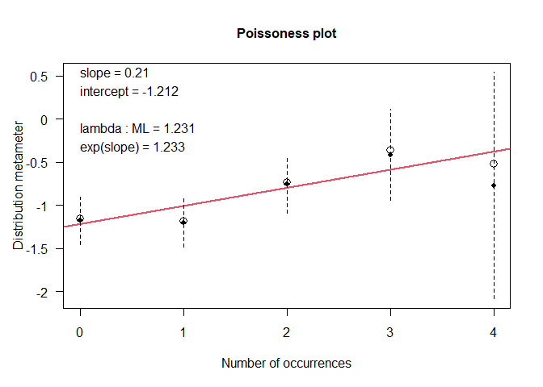

JA bid paper analyses
================
Gideon Salter and Malinda Carpenter
2024-01-26

``` r
library(readr) #Read data file from GitHub
library(tidyverse) #Data manipulation
library(reshape2) #Data manipulation
library(lme4) #Fitting GLMMs
library(MuMIn) #Model comparison
library(emmeans) #Conduct posthoc comparisons
library(sjPlot) #Print tables of coefficients
library(performance) #Check for overdispersion in GLMs/GLMMs
library(vcd) #Visualise distribution of data (here, for count outcome variable)
library(irr) #Calculating inter-rater reliability
```

## Read in data

``` r
data <- read_csv("ja_bid_data.csv")
data <- as_tibble(data)
data$age_days_cen <- scale(data$age_days, center = TRUE, scale = FALSE)
data <- data %>% relocate(age_days_cen, .after = participant)
```

## 1. Analysis of combined data from all tasks (free play and three behavioural tests)

The first set of models examine whether infants’ age predicts whether
they produce a communicative look across all of the four tasks used in
the study.

``` r
# Create new variable with highest value across all 4 tasks
data_2 <- data %>% 
  mutate(highscore_all = (pmax(int_sight, int_sound, moving_toy, freeplay, na.rm = TRUE)))
    
# Build models
model_all1 <- glm(highscore_all ~ age_days_cen + as.factor(participant), family = binomial(link = "logit"), data = data_2)
model_all2 <- glmer(highscore_all ~ age_days_cen + (1|participant), family = binomial(link = "logit"), data = data_2)
model_all3 <- glmer(highscore_all ~ as.factor(age_months) + (1|participant),family = binomial(link = "logit"),data = data_2)

# Model selection
model.sel(model_all1, model_all2, model_all3)
```

    ## Model selection table 
    ##              (Int) age_dys_cen as.fct(prt) as.fct(age_mnt)    class random df
    ## model_all2  0.9231     0.02026                             glmerMod      p  3
    ## model_all3 -0.2667                                       + glmerMod      p  6
    ## model_all1  0.4621     0.02544           +                      glm        26
    ##             logLik  AICc delta weight
    ## model_all2 -69.526 145.3  0.00  0.952
    ## model_all3 -69.249 151.2  5.96  0.048
    ## model_all1 -50.519 167.5 22.26  0.000
    ## Models ranked by AICc(x) 
    ## Random terms: 
    ##  p: 1 | participant

``` r
summary(model_all2)
```

    ## Generalized linear mixed model fit by maximum likelihood (Laplace
    ##   Approximation) [glmerMod]
    ##  Family: binomial  ( logit )
    ## Formula: highscore_all ~ age_days_cen + (1 | participant)
    ##    Data: data_2
    ## 
    ##      AIC      BIC   logLik deviance df.resid 
    ##    145.1    153.5    -69.5    139.1      121 
    ## 
    ## Scaled residuals: 
    ##     Min      1Q  Median      3Q     Max 
    ## -2.8714 -0.8236  0.3857  0.6368  1.3686 
    ## 
    ## Random effects:
    ##  Groups      Name        Variance Std.Dev.
    ##  participant (Intercept) 0.3343   0.5782  
    ## Number of obs: 124, groups:  participant, 25
    ## 
    ## Fixed effects:
    ##              Estimate Std. Error z value Pr(>|z|)    
    ## (Intercept)  0.923138   0.261202   3.534 0.000409 ***
    ## age_days_cen 0.020256   0.005527   3.665 0.000248 ***
    ## ---
    ## Signif. codes:  0 '***' 0.001 '**' 0.01 '*' 0.05 '.' 0.1 ' ' 1
    ## 
    ## Correlation of Fixed Effects:
    ##             (Intr)
    ## age_days_cn 0.311

``` r
confint(model_all2)
```

    ## Computing profile confidence intervals ...

    ##                   2.5 %     97.5 %
    ## .sig01       0.00000000 1.41952314
    ## (Intercept)  0.44264565 1.53677906
    ## age_days_cen 0.01005646 0.03202275

``` r
# Posthoc comparisons on age using model with age as factor
posthoc_all <- emmeans(model_all3, revpairwise~age_months, adjust="Tukey")
summary(posthoc_all$contrasts)
```

    ##  contrast                   estimate    SE  df z.ratio p.value
    ##  age_months7 - age_months6     0.355 0.598 Inf   0.594  0.9761
    ##  age_months8 - age_months6     1.777 0.688 Inf   2.581  0.0738
    ##  age_months8 - age_months7     1.421 0.678 Inf   2.098  0.2208
    ##  age_months9 - age_months6     1.527 0.661 Inf   2.309  0.1420
    ##  age_months9 - age_months7     1.172 0.651 Inf   1.799  0.3740
    ##  age_months9 - age_months8    -0.249 0.706 Inf  -0.353  0.9967
    ##  age_months10 - age_months6    2.343 0.779 Inf   3.006  0.0222
    ##  age_months10 - age_months7    1.988 0.770 Inf   2.584  0.0734
    ##  age_months10 - age_months8    0.567 0.811 Inf   0.698  0.9569
    ##  age_months10 - age_months9    0.816 0.793 Inf   1.029  0.8421
    ## 
    ## Results are given on the log odds ratio (not the response) scale. 
    ## P value adjustment: tukey method for comparing a family of 5 estimates

``` r
confint(posthoc_all$contrasts)
```

    ##  contrast                   estimate    SE  df asymp.LCL asymp.UCL
    ##  age_months7 - age_months6     0.355 0.598 Inf    -1.277      1.99
    ##  age_months8 - age_months6     1.777 0.688 Inf    -0.101      3.65
    ##  age_months8 - age_months7     1.421 0.678 Inf    -0.427      3.27
    ##  age_months9 - age_months6     1.527 0.661 Inf    -0.277      3.33
    ##  age_months9 - age_months7     1.172 0.651 Inf    -0.605      2.95
    ##  age_months9 - age_months8    -0.249 0.706 Inf    -2.175      1.68
    ##  age_months10 - age_months6    2.343 0.779 Inf     0.217      4.47
    ##  age_months10 - age_months7    1.988 0.770 Inf    -0.111      4.09
    ##  age_months10 - age_months8    0.567 0.811 Inf    -1.647      2.78
    ##  age_months10 - age_months9    0.816 0.793 Inf    -1.347      2.98
    ## 
    ## Results are given on the log odds ratio (not the response) scale. 
    ## Confidence level used: 0.95 
    ## Conf-level adjustment: tukey method for comparing a family of 5 estimates

``` r
# Tables of coefficients
tab_model(model_all2, show.se = TRUE)
```

<table style="border-collapse:collapse; border:none;">
<tr>
<th style="border-top: double; text-align:center; font-style:normal; font-weight:bold; padding:0.2cm;  text-align:left; ">
 
</th>
<th colspan="4" style="border-top: double; text-align:center; font-style:normal; font-weight:bold; padding:0.2cm; ">
highscore_all
</th>
</tr>
<tr>
<td style=" text-align:center; border-bottom:1px solid; font-style:italic; font-weight:normal;  text-align:left; ">
Predictors
</td>
<td style=" text-align:center; border-bottom:1px solid; font-style:italic; font-weight:normal;  ">
Odds Ratios
</td>
<td style=" text-align:center; border-bottom:1px solid; font-style:italic; font-weight:normal;  ">
std. Error
</td>
<td style=" text-align:center; border-bottom:1px solid; font-style:italic; font-weight:normal;  ">
CI
</td>
<td style=" text-align:center; border-bottom:1px solid; font-style:italic; font-weight:normal;  ">
p
</td>
</tr>
<tr>
<td style=" padding:0.2cm; text-align:left; vertical-align:top; text-align:left; ">
(Intercept)
</td>
<td style=" padding:0.2cm; text-align:left; vertical-align:top; text-align:center;  ">
2.52
</td>
<td style=" padding:0.2cm; text-align:left; vertical-align:top; text-align:center;  ">
0.66
</td>
<td style=" padding:0.2cm; text-align:left; vertical-align:top; text-align:center;  ">
1.51 – 4.20
</td>
<td style=" padding:0.2cm; text-align:left; vertical-align:top; text-align:center;  ">
<strong>\<0.001</strong>
</td>
</tr>
<tr>
<td style=" padding:0.2cm; text-align:left; vertical-align:top; text-align:left; ">
age days cen
</td>
<td style=" padding:0.2cm; text-align:left; vertical-align:top; text-align:center;  ">
1.02
</td>
<td style=" padding:0.2cm; text-align:left; vertical-align:top; text-align:center;  ">
0.01
</td>
<td style=" padding:0.2cm; text-align:left; vertical-align:top; text-align:center;  ">
1.01 – 1.03
</td>
<td style=" padding:0.2cm; text-align:left; vertical-align:top; text-align:center;  ">
<strong>\<0.001</strong>
</td>
</tr>
<tr>
<td colspan="5" style="font-weight:bold; text-align:left; padding-top:.8em;">
Random Effects
</td>
</tr>
<tr>
<td style=" padding:0.2cm; text-align:left; vertical-align:top; text-align:left; padding-top:0.1cm; padding-bottom:0.1cm;">
σ<sup>2</sup>
</td>
<td style=" padding:0.2cm; text-align:left; vertical-align:top; padding-top:0.1cm; padding-bottom:0.1cm; text-align:left;" colspan="4">
3.29
</td>
</tr>
<tr>
<td style=" padding:0.2cm; text-align:left; vertical-align:top; text-align:left; padding-top:0.1cm; padding-bottom:0.1cm;">
τ<sub>00</sub> <sub>participant</sub>
</td>
<td style=" padding:0.2cm; text-align:left; vertical-align:top; padding-top:0.1cm; padding-bottom:0.1cm; text-align:left;" colspan="4">
0.33
</td>
<tr>
<td style=" padding:0.2cm; text-align:left; vertical-align:top; text-align:left; padding-top:0.1cm; padding-bottom:0.1cm;">
ICC
</td>
<td style=" padding:0.2cm; text-align:left; vertical-align:top; padding-top:0.1cm; padding-bottom:0.1cm; text-align:left;" colspan="4">
0.09
</td>
<tr>
<td style=" padding:0.2cm; text-align:left; vertical-align:top; text-align:left; padding-top:0.1cm; padding-bottom:0.1cm;">
N <sub>participant</sub>
</td>
<td style=" padding:0.2cm; text-align:left; vertical-align:top; padding-top:0.1cm; padding-bottom:0.1cm; text-align:left;" colspan="4">
25
</td>
<tr>
<td style=" padding:0.2cm; text-align:left; vertical-align:top; text-align:left; padding-top:0.1cm; padding-bottom:0.1cm; border-top:1px solid;">
Observations
</td>
<td style=" padding:0.2cm; text-align:left; vertical-align:top; padding-top:0.1cm; padding-bottom:0.1cm; text-align:left; border-top:1px solid;" colspan="4">
124
</td>
</tr>
<tr>
<td style=" padding:0.2cm; text-align:left; vertical-align:top; text-align:left; padding-top:0.1cm; padding-bottom:0.1cm;">
Marginal R<sup>2</sup> / Conditional R<sup>2</sup>
</td>
<td style=" padding:0.2cm; text-align:left; vertical-align:top; padding-top:0.1cm; padding-bottom:0.1cm; text-align:left;" colspan="4">
0.178 / 0.254
</td>
</tr>
</table>

``` r
tab_model(model_all3, show.se = TRUE)
```

<table style="border-collapse:collapse; border:none;">
<tr>
<th style="border-top: double; text-align:center; font-style:normal; font-weight:bold; padding:0.2cm;  text-align:left; ">
 
</th>
<th colspan="4" style="border-top: double; text-align:center; font-style:normal; font-weight:bold; padding:0.2cm; ">
highscore_all
</th>
</tr>
<tr>
<td style=" text-align:center; border-bottom:1px solid; font-style:italic; font-weight:normal;  text-align:left; ">
Predictors
</td>
<td style=" text-align:center; border-bottom:1px solid; font-style:italic; font-weight:normal;  ">
Odds Ratios
</td>
<td style=" text-align:center; border-bottom:1px solid; font-style:italic; font-weight:normal;  ">
std. Error
</td>
<td style=" text-align:center; border-bottom:1px solid; font-style:italic; font-weight:normal;  ">
CI
</td>
<td style=" text-align:center; border-bottom:1px solid; font-style:italic; font-weight:normal;  ">
p
</td>
</tr>
<tr>
<td style=" padding:0.2cm; text-align:left; vertical-align:top; text-align:left; ">
(Intercept)
</td>
<td style=" padding:0.2cm; text-align:left; vertical-align:top; text-align:center;  ">
0.77
</td>
<td style=" padding:0.2cm; text-align:left; vertical-align:top; text-align:center;  ">
0.34
</td>
<td style=" padding:0.2cm; text-align:left; vertical-align:top; text-align:center;  ">
0.32 – 1.83
</td>
<td style=" padding:0.2cm; text-align:left; vertical-align:top; text-align:center;  ">
0.548
</td>
</tr>
<tr>
<td style=" padding:0.2cm; text-align:left; vertical-align:top; text-align:left; ">
age months \[7\]
</td>
<td style=" padding:0.2cm; text-align:left; vertical-align:top; text-align:center;  ">
1.43
</td>
<td style=" padding:0.2cm; text-align:left; vertical-align:top; text-align:center;  ">
0.85
</td>
<td style=" padding:0.2cm; text-align:left; vertical-align:top; text-align:center;  ">
0.44 – 4.61
</td>
<td style=" padding:0.2cm; text-align:left; vertical-align:top; text-align:center;  ">
0.553
</td>
</tr>
<tr>
<td style=" padding:0.2cm; text-align:left; vertical-align:top; text-align:left; ">
age months \[8\]
</td>
<td style=" padding:0.2cm; text-align:left; vertical-align:top; text-align:center;  ">
5.91
</td>
<td style=" padding:0.2cm; text-align:left; vertical-align:top; text-align:center;  ">
4.07
</td>
<td style=" padding:0.2cm; text-align:left; vertical-align:top; text-align:center;  ">
1.53 – 22.77
</td>
<td style=" padding:0.2cm; text-align:left; vertical-align:top; text-align:center;  ">
<strong>0.010</strong>
</td>
</tr>
<tr>
<td style=" padding:0.2cm; text-align:left; vertical-align:top; text-align:left; ">
age months \[9\]
</td>
<td style=" padding:0.2cm; text-align:left; vertical-align:top; text-align:center;  ">
4.61
</td>
<td style=" padding:0.2cm; text-align:left; vertical-align:top; text-align:center;  ">
3.05
</td>
<td style=" padding:0.2cm; text-align:left; vertical-align:top; text-align:center;  ">
1.26 – 16.84
</td>
<td style=" padding:0.2cm; text-align:left; vertical-align:top; text-align:center;  ">
<strong>0.021</strong>
</td>
</tr>
<tr>
<td style=" padding:0.2cm; text-align:left; vertical-align:top; text-align:left; ">
age months \[10\]
</td>
<td style=" padding:0.2cm; text-align:left; vertical-align:top; text-align:center;  ">
10.41
</td>
<td style=" padding:0.2cm; text-align:left; vertical-align:top; text-align:center;  ">
8.12
</td>
<td style=" padding:0.2cm; text-align:left; vertical-align:top; text-align:center;  ">
2.26 – 47.98
</td>
<td style=" padding:0.2cm; text-align:left; vertical-align:top; text-align:center;  ">
<strong>0.003</strong>
</td>
</tr>
<tr>
<td colspan="5" style="font-weight:bold; text-align:left; padding-top:.8em;">
Random Effects
</td>
</tr>
<tr>
<td style=" padding:0.2cm; text-align:left; vertical-align:top; text-align:left; padding-top:0.1cm; padding-bottom:0.1cm;">
σ<sup>2</sup>
</td>
<td style=" padding:0.2cm; text-align:left; vertical-align:top; padding-top:0.1cm; padding-bottom:0.1cm; text-align:left;" colspan="4">
3.29
</td>
</tr>
<tr>
<td style=" padding:0.2cm; text-align:left; vertical-align:top; text-align:left; padding-top:0.1cm; padding-bottom:0.1cm;">
τ<sub>00</sub> <sub>participant</sub>
</td>
<td style=" padding:0.2cm; text-align:left; vertical-align:top; padding-top:0.1cm; padding-bottom:0.1cm; text-align:left;" colspan="4">
0.42
</td>
<tr>
<td style=" padding:0.2cm; text-align:left; vertical-align:top; text-align:left; padding-top:0.1cm; padding-bottom:0.1cm;">
ICC
</td>
<td style=" padding:0.2cm; text-align:left; vertical-align:top; padding-top:0.1cm; padding-bottom:0.1cm; text-align:left;" colspan="4">
0.11
</td>
<tr>
<td style=" padding:0.2cm; text-align:left; vertical-align:top; text-align:left; padding-top:0.1cm; padding-bottom:0.1cm;">
N <sub>participant</sub>
</td>
<td style=" padding:0.2cm; text-align:left; vertical-align:top; padding-top:0.1cm; padding-bottom:0.1cm; text-align:left;" colspan="4">
25
</td>
<tr>
<td style=" padding:0.2cm; text-align:left; vertical-align:top; text-align:left; padding-top:0.1cm; padding-bottom:0.1cm; border-top:1px solid;">
Observations
</td>
<td style=" padding:0.2cm; text-align:left; vertical-align:top; padding-top:0.1cm; padding-bottom:0.1cm; text-align:left; border-top:1px solid;" colspan="4">
124
</td>
</tr>
<tr>
<td style=" padding:0.2cm; text-align:left; vertical-align:top; text-align:left; padding-top:0.1cm; padding-bottom:0.1cm;">
Marginal R<sup>2</sup> / Conditional R<sup>2</sup>
</td>
<td style=" padding:0.2cm; text-align:left; vertical-align:top; padding-top:0.1cm; padding-bottom:0.1cm; text-align:left;" colspan="4">
0.174 / 0.267
</td>
</tr>
</table>

## 2. Analysis of data from free play

The second set of models examine whether infants’ age predicts whether
they produce a communicative look during free play.

``` r
# Build Models
model_fp1 <- glm(freeplay ~ age_days_cen + as.factor(participant), family = binomial(link = "logit"), data = data)
model_fp2 <- glmer(freeplay ~ age_days_cen + (1|participant), family = binomial(link = "logit"), data = data)
model_fp3 <- glmer(freeplay ~ as.factor(age_months) + (1|participant), family = binomial(link = "logit"), data = data)
  
# Model selection
model.sel(model_fp1, model_fp2, model_fp3)
```

    ## Model selection table 
    ##            (Int) age_dys_cen as.fct(prt) as.fct(age_mnt)    class random df
    ## model_fp2 -1.700     0.02604                             glmerMod      p  3
    ## model_fp3 -3.203                                       + glmerMod      p  6
    ## model_fp1 -1.989     0.03282           +                      glm        26
    ##            logLik  AICc delta weight
    ## model_fp2 -58.694 123.6  0.00  0.898
    ## model_fp3 -57.624 128.0  4.38  0.101
    ## model_fp1 -35.179 136.8 13.24  0.001
    ## Models ranked by AICc(x) 
    ## Random terms: 
    ##  p: 1 | participant

``` r
summary(model_fp2)
```

    ## Generalized linear mixed model fit by maximum likelihood (Laplace
    ##   Approximation) [glmerMod]
    ##  Family: binomial  ( logit )
    ## Formula: freeplay ~ age_days_cen + (1 | participant)
    ##    Data: data
    ## 
    ##      AIC      BIC   logLik deviance df.resid 
    ##    123.4    131.8    -58.7    117.4      121 
    ## 
    ## Scaled residuals: 
    ##     Min      1Q  Median      3Q     Max 
    ## -1.3043 -0.4266 -0.2760  0.0332  5.0997 
    ## 
    ## Random effects:
    ##  Groups      Name        Variance Std.Dev.
    ##  participant (Intercept) 1.774    1.332   
    ## Number of obs: 124, groups:  participant, 25
    ## 
    ## Fixed effects:
    ##               Estimate Std. Error z value Pr(>|z|)    
    ## (Intercept)  -1.699873   0.458835  -3.705 0.000212 ***
    ## age_days_cen  0.026036   0.007117   3.658 0.000254 ***
    ## ---
    ## Signif. codes:  0 '***' 0.001 '**' 0.01 '*' 0.05 '.' 0.1 ' ' 1
    ## 
    ## Correlation of Fixed Effects:
    ##             (Intr)
    ## age_days_cn -0.424

``` r
confint(model_fp2)
```

    ## Computing profile confidence intervals ...

    ##                    2.5 %      97.5 %
    ## .sig01        0.44376366  2.62425926
    ## (Intercept)  -2.88144609 -0.93854966
    ## age_days_cen  0.01325894  0.04155617

``` r
# Posthoc comparisons on age using model with age as factor
posthoc_fp <- emmeans(model_fp3, revpairwise ~ age_months, adjust="Tukey")
summary(posthoc_fp$contrasts)
```

    ##  contrast                    estimate    SE  df z.ratio p.value
    ##  age_months7 - age_months6  -6.70e-06 1.106 Inf   0.000  1.0000
    ##  age_months8 - age_months6   1.58e+00 0.966 Inf   1.632  0.4766
    ##  age_months8 - age_months7   1.58e+00 0.966 Inf   1.632  0.4766
    ##  age_months9 - age_months6   2.84e+00 0.987 Inf   2.876  0.0329
    ##  age_months9 - age_months7   2.84e+00 0.987 Inf   2.876  0.0329
    ##  age_months9 - age_months8   1.26e+00 0.747 Inf   1.689  0.4409
    ##  age_months10 - age_months6  2.66e+00 0.980 Inf   2.718  0.0514
    ##  age_months10 - age_months7  2.66e+00 0.980 Inf   2.718  0.0514
    ##  age_months10 - age_months8  1.09e+00 0.747 Inf   1.454  0.5924
    ##  age_months10 - age_months9 -1.75e-01 0.692 Inf  -0.253  0.9991
    ## 
    ## Results are given on the log odds ratio (not the response) scale. 
    ## P value adjustment: tukey method for comparing a family of 5 estimates

``` r
confint(posthoc_fp$contrasts)
```

    ##  contrast                    estimate    SE  df asymp.LCL asymp.UCL
    ##  age_months7 - age_months6  -6.70e-06 1.106 Inf    -3.017      3.02
    ##  age_months8 - age_months6   1.58e+00 0.966 Inf    -1.058      4.21
    ##  age_months8 - age_months7   1.58e+00 0.966 Inf    -1.058      4.21
    ##  age_months9 - age_months6   2.84e+00 0.987 Inf     0.146      5.53
    ##  age_months9 - age_months7   2.84e+00 0.987 Inf     0.146      5.53
    ##  age_months9 - age_months8   1.26e+00 0.747 Inf    -0.776      3.30
    ##  age_months10 - age_months6  2.66e+00 0.980 Inf    -0.010      5.33
    ##  age_months10 - age_months7  2.66e+00 0.980 Inf    -0.010      5.34
    ##  age_months10 - age_months8  1.09e+00 0.747 Inf    -0.951      3.12
    ##  age_months10 - age_months9 -1.75e-01 0.692 Inf    -2.063      1.71
    ## 
    ## Results are given on the log odds ratio (not the response) scale. 
    ## Confidence level used: 0.95 
    ## Conf-level adjustment: tukey method for comparing a family of 5 estimates

``` r
# Tables of coefficients
tab_model(model_fp2, show.se = TRUE)
```

<table style="border-collapse:collapse; border:none;">
<tr>
<th style="border-top: double; text-align:center; font-style:normal; font-weight:bold; padding:0.2cm;  text-align:left; ">
 
</th>
<th colspan="4" style="border-top: double; text-align:center; font-style:normal; font-weight:bold; padding:0.2cm; ">
freeplay
</th>
</tr>
<tr>
<td style=" text-align:center; border-bottom:1px solid; font-style:italic; font-weight:normal;  text-align:left; ">
Predictors
</td>
<td style=" text-align:center; border-bottom:1px solid; font-style:italic; font-weight:normal;  ">
Odds Ratios
</td>
<td style=" text-align:center; border-bottom:1px solid; font-style:italic; font-weight:normal;  ">
std. Error
</td>
<td style=" text-align:center; border-bottom:1px solid; font-style:italic; font-weight:normal;  ">
CI
</td>
<td style=" text-align:center; border-bottom:1px solid; font-style:italic; font-weight:normal;  ">
p
</td>
</tr>
<tr>
<td style=" padding:0.2cm; text-align:left; vertical-align:top; text-align:left; ">
(Intercept)
</td>
<td style=" padding:0.2cm; text-align:left; vertical-align:top; text-align:center;  ">
0.18
</td>
<td style=" padding:0.2cm; text-align:left; vertical-align:top; text-align:center;  ">
0.08
</td>
<td style=" padding:0.2cm; text-align:left; vertical-align:top; text-align:center;  ">
0.07 – 0.45
</td>
<td style=" padding:0.2cm; text-align:left; vertical-align:top; text-align:center;  ">
<strong>\<0.001</strong>
</td>
</tr>
<tr>
<td style=" padding:0.2cm; text-align:left; vertical-align:top; text-align:left; ">
age days cen
</td>
<td style=" padding:0.2cm; text-align:left; vertical-align:top; text-align:center;  ">
1.03
</td>
<td style=" padding:0.2cm; text-align:left; vertical-align:top; text-align:center;  ">
0.01
</td>
<td style=" padding:0.2cm; text-align:left; vertical-align:top; text-align:center;  ">
1.01 – 1.04
</td>
<td style=" padding:0.2cm; text-align:left; vertical-align:top; text-align:center;  ">
<strong>\<0.001</strong>
</td>
</tr>
<tr>
<td colspan="5" style="font-weight:bold; text-align:left; padding-top:.8em;">
Random Effects
</td>
</tr>
<tr>
<td style=" padding:0.2cm; text-align:left; vertical-align:top; text-align:left; padding-top:0.1cm; padding-bottom:0.1cm;">
σ<sup>2</sup>
</td>
<td style=" padding:0.2cm; text-align:left; vertical-align:top; padding-top:0.1cm; padding-bottom:0.1cm; text-align:left;" colspan="4">
3.29
</td>
</tr>
<tr>
<td style=" padding:0.2cm; text-align:left; vertical-align:top; text-align:left; padding-top:0.1cm; padding-bottom:0.1cm;">
τ<sub>00</sub> <sub>participant</sub>
</td>
<td style=" padding:0.2cm; text-align:left; vertical-align:top; padding-top:0.1cm; padding-bottom:0.1cm; text-align:left;" colspan="4">
1.77
</td>
<tr>
<td style=" padding:0.2cm; text-align:left; vertical-align:top; text-align:left; padding-top:0.1cm; padding-bottom:0.1cm;">
ICC
</td>
<td style=" padding:0.2cm; text-align:left; vertical-align:top; padding-top:0.1cm; padding-bottom:0.1cm; text-align:left;" colspan="4">
0.35
</td>
<tr>
<td style=" padding:0.2cm; text-align:left; vertical-align:top; text-align:left; padding-top:0.1cm; padding-bottom:0.1cm;">
N <sub>participant</sub>
</td>
<td style=" padding:0.2cm; text-align:left; vertical-align:top; padding-top:0.1cm; padding-bottom:0.1cm; text-align:left;" colspan="4">
25
</td>
<tr>
<td style=" padding:0.2cm; text-align:left; vertical-align:top; text-align:left; padding-top:0.1cm; padding-bottom:0.1cm; border-top:1px solid;">
Observations
</td>
<td style=" padding:0.2cm; text-align:left; vertical-align:top; padding-top:0.1cm; padding-bottom:0.1cm; text-align:left; border-top:1px solid;" colspan="4">
124
</td>
</tr>
<tr>
<td style=" padding:0.2cm; text-align:left; vertical-align:top; text-align:left; padding-top:0.1cm; padding-bottom:0.1cm;">
Marginal R<sup>2</sup> / Conditional R<sup>2</sup>
</td>
<td style=" padding:0.2cm; text-align:left; vertical-align:top; padding-top:0.1cm; padding-bottom:0.1cm; text-align:left;" colspan="4">
0.204 / 0.483
</td>
</tr>
</table>

``` r
tab_model(model_fp3, show.se = TRUE)
```

<table style="border-collapse:collapse; border:none;">
<tr>
<th style="border-top: double; text-align:center; font-style:normal; font-weight:bold; padding:0.2cm;  text-align:left; ">
 
</th>
<th colspan="4" style="border-top: double; text-align:center; font-style:normal; font-weight:bold; padding:0.2cm; ">
freeplay
</th>
</tr>
<tr>
<td style=" text-align:center; border-bottom:1px solid; font-style:italic; font-weight:normal;  text-align:left; ">
Predictors
</td>
<td style=" text-align:center; border-bottom:1px solid; font-style:italic; font-weight:normal;  ">
Odds Ratios
</td>
<td style=" text-align:center; border-bottom:1px solid; font-style:italic; font-weight:normal;  ">
std. Error
</td>
<td style=" text-align:center; border-bottom:1px solid; font-style:italic; font-weight:normal;  ">
CI
</td>
<td style=" text-align:center; border-bottom:1px solid; font-style:italic; font-weight:normal;  ">
p
</td>
</tr>
<tr>
<td style=" padding:0.2cm; text-align:left; vertical-align:top; text-align:left; ">
(Intercept)
</td>
<td style=" padding:0.2cm; text-align:left; vertical-align:top; text-align:center;  ">
0.04
</td>
<td style=" padding:0.2cm; text-align:left; vertical-align:top; text-align:center;  ">
0.04
</td>
<td style=" padding:0.2cm; text-align:left; vertical-align:top; text-align:center;  ">
0.01 – 0.26
</td>
<td style=" padding:0.2cm; text-align:left; vertical-align:top; text-align:center;  ">
<strong>0.001</strong>
</td>
</tr>
<tr>
<td style=" padding:0.2cm; text-align:left; vertical-align:top; text-align:left; ">
age months \[7\]
</td>
<td style=" padding:0.2cm; text-align:left; vertical-align:top; text-align:center;  ">
1.00
</td>
<td style=" padding:0.2cm; text-align:left; vertical-align:top; text-align:center;  ">
1.11
</td>
<td style=" padding:0.2cm; text-align:left; vertical-align:top; text-align:center;  ">
0.11 – 8.74
</td>
<td style=" padding:0.2cm; text-align:left; vertical-align:top; text-align:center;  ">
1.000
</td>
</tr>
<tr>
<td style=" padding:0.2cm; text-align:left; vertical-align:top; text-align:left; ">
age months \[8\]
</td>
<td style=" padding:0.2cm; text-align:left; vertical-align:top; text-align:center;  ">
4.84
</td>
<td style=" padding:0.2cm; text-align:left; vertical-align:top; text-align:center;  ">
4.67
</td>
<td style=" padding:0.2cm; text-align:left; vertical-align:top; text-align:center;  ">
0.73 – 32.13
</td>
<td style=" padding:0.2cm; text-align:left; vertical-align:top; text-align:center;  ">
0.103
</td>
</tr>
<tr>
<td style=" padding:0.2cm; text-align:left; vertical-align:top; text-align:left; ">
age months \[9\]
</td>
<td style=" padding:0.2cm; text-align:left; vertical-align:top; text-align:center;  ">
17.08
</td>
<td style=" padding:0.2cm; text-align:left; vertical-align:top; text-align:center;  ">
16.86
</td>
<td style=" padding:0.2cm; text-align:left; vertical-align:top; text-align:center;  ">
2.47 – 118.17
</td>
<td style=" padding:0.2cm; text-align:left; vertical-align:top; text-align:center;  ">
<strong>0.004</strong>
</td>
</tr>
<tr>
<td style=" padding:0.2cm; text-align:left; vertical-align:top; text-align:left; ">
age months \[10\]
</td>
<td style=" padding:0.2cm; text-align:left; vertical-align:top; text-align:center;  ">
14.33
</td>
<td style=" padding:0.2cm; text-align:left; vertical-align:top; text-align:center;  ">
14.04
</td>
<td style=" padding:0.2cm; text-align:left; vertical-align:top; text-align:center;  ">
2.10 – 97.78
</td>
<td style=" padding:0.2cm; text-align:left; vertical-align:top; text-align:center;  ">
<strong>0.007</strong>
</td>
</tr>
<tr>
<td colspan="5" style="font-weight:bold; text-align:left; padding-top:.8em;">
Random Effects
</td>
</tr>
<tr>
<td style=" padding:0.2cm; text-align:left; vertical-align:top; text-align:left; padding-top:0.1cm; padding-bottom:0.1cm;">
σ<sup>2</sup>
</td>
<td style=" padding:0.2cm; text-align:left; vertical-align:top; padding-top:0.1cm; padding-bottom:0.1cm; text-align:left;" colspan="4">
3.29
</td>
</tr>
<tr>
<td style=" padding:0.2cm; text-align:left; vertical-align:top; text-align:left; padding-top:0.1cm; padding-bottom:0.1cm;">
τ<sub>00</sub> <sub>participant</sub>
</td>
<td style=" padding:0.2cm; text-align:left; vertical-align:top; padding-top:0.1cm; padding-bottom:0.1cm; text-align:left;" colspan="4">
2.09
</td>
<tr>
<td style=" padding:0.2cm; text-align:left; vertical-align:top; text-align:left; padding-top:0.1cm; padding-bottom:0.1cm;">
ICC
</td>
<td style=" padding:0.2cm; text-align:left; vertical-align:top; padding-top:0.1cm; padding-bottom:0.1cm; text-align:left;" colspan="4">
0.39
</td>
<tr>
<td style=" padding:0.2cm; text-align:left; vertical-align:top; text-align:left; padding-top:0.1cm; padding-bottom:0.1cm;">
N <sub>participant</sub>
</td>
<td style=" padding:0.2cm; text-align:left; vertical-align:top; padding-top:0.1cm; padding-bottom:0.1cm; text-align:left;" colspan="4">
25
</td>
<tr>
<td style=" padding:0.2cm; text-align:left; vertical-align:top; text-align:left; padding-top:0.1cm; padding-bottom:0.1cm; border-top:1px solid;">
Observations
</td>
<td style=" padding:0.2cm; text-align:left; vertical-align:top; padding-top:0.1cm; padding-bottom:0.1cm; text-align:left; border-top:1px solid;" colspan="4">
124
</td>
</tr>
<tr>
<td style=" padding:0.2cm; text-align:left; vertical-align:top; text-align:left; padding-top:0.1cm; padding-bottom:0.1cm;">
Marginal R<sup>2</sup> / Conditional R<sup>2</sup>
</td>
<td style=" padding:0.2cm; text-align:left; vertical-align:top; padding-top:0.1cm; padding-bottom:0.1cm; text-align:left;" colspan="4">
0.222 / 0.524
</td>
</tr>
</table>

## 3. Data from behavioural tests

The third set of models examine whether infants’ age predicts whether
they produce a communicative look during the three behavioural tests.

``` r
# Create new variable with highest value across the 3 behavioural tasks
data_3 <- data %>%
          mutate(highscore_bt = (pmax(int_sight, int_sound, moving_toy, na.rm = TRUE)))
    
# Build models
model_tests1 <- glm(highscore_bt ~ age_days_cen + as.factor(participant), family = binomial(link = "logit"), data = data_3)
model_tests2 <- glmer(highscore_bt ~ age_days_cen + (1|participant), family = binomial(link = "logit"), data = data_3)
model_tests3 <- glmer(highscore_bt ~ as.factor(age_months) + (1|participant), family = binomial(link = "logit"), data =      data_3)
    
# Model selection
model.sel(model_tests1, model_tests2, model_tests3)
```

    ## Model selection table 
    ##                (Int) age_dys_cen as.fct(prt) as.fct(age_mnt)    class random df
    ## model_tests2  0.5593     0.01545                             glmerMod      p  3
    ## model_tests3 -0.4166                                       + glmerMod      p  6
    ## model_tests1  0.4292     0.01913           +                      glm        26
    ##               logLik  AICc delta weight
    ## model_tests2 -76.433 159.1  0.00  0.946
    ## model_tests3 -76.040 164.8  5.73  0.054
    ## model_tests1 -60.153 186.8 27.71  0.000
    ## Models ranked by AICc(x) 
    ## Random terms: 
    ##  p: 1 | participant

``` r
summary(model_tests2)
```

    ## Generalized linear mixed model fit by maximum likelihood (Laplace
    ##   Approximation) [glmerMod]
    ##  Family: binomial  ( logit )
    ## Formula: highscore_bt ~ age_days_cen + (1 | participant)
    ##    Data: data_3
    ## 
    ##      AIC      BIC   logLik deviance df.resid 
    ##    158.9    167.3    -76.4    152.9      121 
    ## 
    ## Scaled residuals: 
    ##     Min      1Q  Median      3Q     Max 
    ## -2.1655 -0.9146  0.4791  0.7382  1.2401 
    ## 
    ## Random effects:
    ##  Groups      Name        Variance Std.Dev.
    ##  participant (Intercept) 0.08312  0.2883  
    ## Number of obs: 124, groups:  participant, 25
    ## 
    ## Fixed effects:
    ##              Estimate Std. Error z value Pr(>|z|)   
    ## (Intercept)   0.55932    0.21006   2.663  0.00775 **
    ## age_days_cen  0.01545    0.00482   3.206  0.00135 **
    ## ---
    ## Signif. codes:  0 '***' 0.001 '**' 0.01 '*' 0.05 '.' 0.1 ' ' 1
    ## 
    ## Correlation of Fixed Effects:
    ##             (Intr)
    ## age_days_cn 0.187

``` r
confint(model_tests2)
```

    ## Computing profile confidence intervals ...

    ##                    2.5 %     97.5 %
    ## .sig01       0.000000000 1.08072644
    ## (Intercept)  0.153407887 1.03075029
    ## age_days_cen 0.006403618 0.02547153

``` r
# Posthoc comparisons on age using model with age as factor
posthoc_tests <- emmeans(model_tests3, revpairwise ~ age_months, adjust="Tukey")
summary(posthoc_tests$contrasts)
```

    ##  contrast                   estimate    SE  df z.ratio p.value
    ##  age_months7 - age_months6     0.499 0.581 Inf   0.859  0.9118
    ##  age_months8 - age_months6     1.385 0.621 Inf   2.232  0.1678
    ##  age_months8 - age_months7     0.887 0.610 Inf   1.454  0.5926
    ##  age_months9 - age_months6     1.008 0.596 Inf   1.690  0.4404
    ##  age_months9 - age_months7     0.509 0.587 Inf   0.867  0.9090
    ##  age_months9 - age_months8    -0.378 0.618 Inf  -0.612  0.9733
    ##  age_months10 - age_months6    2.057 0.701 Inf   2.934  0.0277
    ##  age_months10 - age_months7    1.558 0.690 Inf   2.257  0.1591
    ##  age_months10 - age_months8    0.672 0.712 Inf   0.943  0.8801
    ##  age_months10 - age_months9    1.050 0.696 Inf   1.508  0.5573
    ## 
    ## Results are given on the log odds ratio (not the response) scale. 
    ## P value adjustment: tukey method for comparing a family of 5 estimates

``` r
confint(posthoc_tests$contrasts)
```

    ##  contrast                   estimate    SE  df asymp.LCL asymp.UCL
    ##  age_months7 - age_months6     0.499 0.581 Inf    -1.086      2.08
    ##  age_months8 - age_months6     1.385 0.621 Inf    -0.308      3.08
    ##  age_months8 - age_months7     0.887 0.610 Inf    -0.777      2.55
    ##  age_months9 - age_months6     1.008 0.596 Inf    -0.619      2.63
    ##  age_months9 - age_months7     0.509 0.587 Inf    -1.092      2.11
    ##  age_months9 - age_months8    -0.378 0.618 Inf    -2.062      1.31
    ##  age_months10 - age_months6    2.057 0.701 Inf     0.144      3.97
    ##  age_months10 - age_months7    1.558 0.690 Inf    -0.325      3.44
    ##  age_months10 - age_months8    0.672 0.712 Inf    -1.272      2.61
    ##  age_months10 - age_months9    1.050 0.696 Inf    -0.849      2.95
    ## 
    ## Results are given on the log odds ratio (not the response) scale. 
    ## Confidence level used: 0.95 
    ## Conf-level adjustment: tukey method for comparing a family of 5 estimates

``` r
# Tables of coefficients
tab_model(model_tests2, show.se = TRUE)
```

<table style="border-collapse:collapse; border:none;">
<tr>
<th style="border-top: double; text-align:center; font-style:normal; font-weight:bold; padding:0.2cm;  text-align:left; ">
 
</th>
<th colspan="4" style="border-top: double; text-align:center; font-style:normal; font-weight:bold; padding:0.2cm; ">
highscore_bt
</th>
</tr>
<tr>
<td style=" text-align:center; border-bottom:1px solid; font-style:italic; font-weight:normal;  text-align:left; ">
Predictors
</td>
<td style=" text-align:center; border-bottom:1px solid; font-style:italic; font-weight:normal;  ">
Odds Ratios
</td>
<td style=" text-align:center; border-bottom:1px solid; font-style:italic; font-weight:normal;  ">
std. Error
</td>
<td style=" text-align:center; border-bottom:1px solid; font-style:italic; font-weight:normal;  ">
CI
</td>
<td style=" text-align:center; border-bottom:1px solid; font-style:italic; font-weight:normal;  ">
p
</td>
</tr>
<tr>
<td style=" padding:0.2cm; text-align:left; vertical-align:top; text-align:left; ">
(Intercept)
</td>
<td style=" padding:0.2cm; text-align:left; vertical-align:top; text-align:center;  ">
1.75
</td>
<td style=" padding:0.2cm; text-align:left; vertical-align:top; text-align:center;  ">
0.37
</td>
<td style=" padding:0.2cm; text-align:left; vertical-align:top; text-align:center;  ">
1.16 – 2.64
</td>
<td style=" padding:0.2cm; text-align:left; vertical-align:top; text-align:center;  ">
<strong>0.008</strong>
</td>
</tr>
<tr>
<td style=" padding:0.2cm; text-align:left; vertical-align:top; text-align:left; ">
age days cen
</td>
<td style=" padding:0.2cm; text-align:left; vertical-align:top; text-align:center;  ">
1.02
</td>
<td style=" padding:0.2cm; text-align:left; vertical-align:top; text-align:center;  ">
0.00
</td>
<td style=" padding:0.2cm; text-align:left; vertical-align:top; text-align:center;  ">
1.01 – 1.03
</td>
<td style=" padding:0.2cm; text-align:left; vertical-align:top; text-align:center;  ">
<strong>0.001</strong>
</td>
</tr>
<tr>
<td colspan="5" style="font-weight:bold; text-align:left; padding-top:.8em;">
Random Effects
</td>
</tr>
<tr>
<td style=" padding:0.2cm; text-align:left; vertical-align:top; text-align:left; padding-top:0.1cm; padding-bottom:0.1cm;">
σ<sup>2</sup>
</td>
<td style=" padding:0.2cm; text-align:left; vertical-align:top; padding-top:0.1cm; padding-bottom:0.1cm; text-align:left;" colspan="4">
3.29
</td>
</tr>
<tr>
<td style=" padding:0.2cm; text-align:left; vertical-align:top; text-align:left; padding-top:0.1cm; padding-bottom:0.1cm;">
τ<sub>00</sub> <sub>participant</sub>
</td>
<td style=" padding:0.2cm; text-align:left; vertical-align:top; padding-top:0.1cm; padding-bottom:0.1cm; text-align:left;" colspan="4">
0.08
</td>
<tr>
<td style=" padding:0.2cm; text-align:left; vertical-align:top; text-align:left; padding-top:0.1cm; padding-bottom:0.1cm;">
ICC
</td>
<td style=" padding:0.2cm; text-align:left; vertical-align:top; padding-top:0.1cm; padding-bottom:0.1cm; text-align:left;" colspan="4">
0.02
</td>
<tr>
<td style=" padding:0.2cm; text-align:left; vertical-align:top; text-align:left; padding-top:0.1cm; padding-bottom:0.1cm;">
N <sub>participant</sub>
</td>
<td style=" padding:0.2cm; text-align:left; vertical-align:top; padding-top:0.1cm; padding-bottom:0.1cm; text-align:left;" colspan="4">
25
</td>
<tr>
<td style=" padding:0.2cm; text-align:left; vertical-align:top; text-align:left; padding-top:0.1cm; padding-bottom:0.1cm; border-top:1px solid;">
Observations
</td>
<td style=" padding:0.2cm; text-align:left; vertical-align:top; padding-top:0.1cm; padding-bottom:0.1cm; text-align:left; border-top:1px solid;" colspan="4">
124
</td>
</tr>
<tr>
<td style=" padding:0.2cm; text-align:left; vertical-align:top; text-align:left; padding-top:0.1cm; padding-bottom:0.1cm;">
Marginal R<sup>2</sup> / Conditional R<sup>2</sup>
</td>
<td style=" padding:0.2cm; text-align:left; vertical-align:top; padding-top:0.1cm; padding-bottom:0.1cm; text-align:left;" colspan="4">
0.119 / 0.141
</td>
</tr>
</table>

``` r
tab_model(model_tests3, show.se = TRUE)
```

<table style="border-collapse:collapse; border:none;">
<tr>
<th style="border-top: double; text-align:center; font-style:normal; font-weight:bold; padding:0.2cm;  text-align:left; ">
 
</th>
<th colspan="4" style="border-top: double; text-align:center; font-style:normal; font-weight:bold; padding:0.2cm; ">
highscore_bt
</th>
</tr>
<tr>
<td style=" text-align:center; border-bottom:1px solid; font-style:italic; font-weight:normal;  text-align:left; ">
Predictors
</td>
<td style=" text-align:center; border-bottom:1px solid; font-style:italic; font-weight:normal;  ">
Odds Ratios
</td>
<td style=" text-align:center; border-bottom:1px solid; font-style:italic; font-weight:normal;  ">
std. Error
</td>
<td style=" text-align:center; border-bottom:1px solid; font-style:italic; font-weight:normal;  ">
CI
</td>
<td style=" text-align:center; border-bottom:1px solid; font-style:italic; font-weight:normal;  ">
p
</td>
</tr>
<tr>
<td style=" padding:0.2cm; text-align:left; vertical-align:top; text-align:left; ">
(Intercept)
</td>
<td style=" padding:0.2cm; text-align:left; vertical-align:top; text-align:center;  ">
0.66
</td>
<td style=" padding:0.2cm; text-align:left; vertical-align:top; text-align:center;  ">
0.28
</td>
<td style=" padding:0.2cm; text-align:left; vertical-align:top; text-align:center;  ">
0.29 – 1.50
</td>
<td style=" padding:0.2cm; text-align:left; vertical-align:top; text-align:center;  ">
0.322
</td>
</tr>
<tr>
<td style=" padding:0.2cm; text-align:left; vertical-align:top; text-align:left; ">
age months \[7\]
</td>
<td style=" padding:0.2cm; text-align:left; vertical-align:top; text-align:center;  ">
1.65
</td>
<td style=" padding:0.2cm; text-align:left; vertical-align:top; text-align:center;  ">
0.96
</td>
<td style=" padding:0.2cm; text-align:left; vertical-align:top; text-align:center;  ">
0.53 – 5.14
</td>
<td style=" padding:0.2cm; text-align:left; vertical-align:top; text-align:center;  ">
0.390
</td>
</tr>
<tr>
<td style=" padding:0.2cm; text-align:left; vertical-align:top; text-align:left; ">
age months \[8\]
</td>
<td style=" padding:0.2cm; text-align:left; vertical-align:top; text-align:center;  ">
4.00
</td>
<td style=" padding:0.2cm; text-align:left; vertical-align:top; text-align:center;  ">
2.48
</td>
<td style=" padding:0.2cm; text-align:left; vertical-align:top; text-align:center;  ">
1.18 – 13.49
</td>
<td style=" padding:0.2cm; text-align:left; vertical-align:top; text-align:center;  ">
<strong>0.026</strong>
</td>
</tr>
<tr>
<td style=" padding:0.2cm; text-align:left; vertical-align:top; text-align:left; ">
age months \[9\]
</td>
<td style=" padding:0.2cm; text-align:left; vertical-align:top; text-align:center;  ">
2.74
</td>
<td style=" padding:0.2cm; text-align:left; vertical-align:top; text-align:center;  ">
1.63
</td>
<td style=" padding:0.2cm; text-align:left; vertical-align:top; text-align:center;  ">
0.85 – 8.81
</td>
<td style=" padding:0.2cm; text-align:left; vertical-align:top; text-align:center;  ">
0.091
</td>
</tr>
<tr>
<td style=" padding:0.2cm; text-align:left; vertical-align:top; text-align:left; ">
age months \[10\]
</td>
<td style=" padding:0.2cm; text-align:left; vertical-align:top; text-align:center;  ">
7.82
</td>
<td style=" padding:0.2cm; text-align:left; vertical-align:top; text-align:center;  ">
5.49
</td>
<td style=" padding:0.2cm; text-align:left; vertical-align:top; text-align:center;  ">
1.98 – 30.93
</td>
<td style=" padding:0.2cm; text-align:left; vertical-align:top; text-align:center;  ">
<strong>0.003</strong>
</td>
</tr>
<tr>
<td colspan="5" style="font-weight:bold; text-align:left; padding-top:.8em;">
Random Effects
</td>
</tr>
<tr>
<td style=" padding:0.2cm; text-align:left; vertical-align:top; text-align:left; padding-top:0.1cm; padding-bottom:0.1cm;">
σ<sup>2</sup>
</td>
<td style=" padding:0.2cm; text-align:left; vertical-align:top; padding-top:0.1cm; padding-bottom:0.1cm; text-align:left;" colspan="4">
3.29
</td>
</tr>
<tr>
<td style=" padding:0.2cm; text-align:left; vertical-align:top; text-align:left; padding-top:0.1cm; padding-bottom:0.1cm;">
τ<sub>00</sub> <sub>participant</sub>
</td>
<td style=" padding:0.2cm; text-align:left; vertical-align:top; padding-top:0.1cm; padding-bottom:0.1cm; text-align:left;" colspan="4">
0.11
</td>
<tr>
<td style=" padding:0.2cm; text-align:left; vertical-align:top; text-align:left; padding-top:0.1cm; padding-bottom:0.1cm;">
ICC
</td>
<td style=" padding:0.2cm; text-align:left; vertical-align:top; padding-top:0.1cm; padding-bottom:0.1cm; text-align:left;" colspan="4">
0.03
</td>
<tr>
<td style=" padding:0.2cm; text-align:left; vertical-align:top; text-align:left; padding-top:0.1cm; padding-bottom:0.1cm;">
N <sub>participant</sub>
</td>
<td style=" padding:0.2cm; text-align:left; vertical-align:top; padding-top:0.1cm; padding-bottom:0.1cm; text-align:left;" colspan="4">
25
</td>
<tr>
<td style=" padding:0.2cm; text-align:left; vertical-align:top; text-align:left; padding-top:0.1cm; padding-bottom:0.1cm; border-top:1px solid;">
Observations
</td>
<td style=" padding:0.2cm; text-align:left; vertical-align:top; padding-top:0.1cm; padding-bottom:0.1cm; text-align:left; border-top:1px solid;" colspan="4">
124
</td>
</tr>
<tr>
<td style=" padding:0.2cm; text-align:left; vertical-align:top; text-align:left; padding-top:0.1cm; padding-bottom:0.1cm;">
Marginal R<sup>2</sup> / Conditional R<sup>2</sup>
</td>
<td style=" padding:0.2cm; text-align:left; vertical-align:top; padding-top:0.1cm; padding-bottom:0.1cm; text-align:left;" colspan="4">
0.129 / 0.157
</td>
</tr>
</table>

## 4. Data split into experimental tests versus free play

The fourth set of models examine whether infants’ age and type of task
(free play or behavioural test, combining the three tests) predict
whether they produce a communicative look.

``` r
# Create new longform dataset
data_3 <- data %>%
          mutate(highscore_bt = (pmax(int_sight, int_sound, moving_toy, na.rm = TRUE)))
data_4 <- data_3 %>% select (c(participant, age_days_cen, freeplay, highscore_bt))
data_long_1 <- melt(data_4, id = c("participant", "age_days_cen"))
data_long_1 <- as_tibble(data_long_1)
names(data_long_1) <- c("participant", "age_days_cen", "type", "score")

#For categorical age
data_5 <- data_3 %>% select (c(participant, age_months, freeplay, highscore_bt))
data_long_2 <- melt(data_5, id = c("participant", "age_months"))
data_long_2 <- as_tibble(data_long_2)
names(data_long_2) <- c("participant", "age_months", "type", "score")
    
# Build models
model_testfp1 <- glm(score ~ age_days_cen + as.factor(participant) + type, family = binomial(link = "logit"), data = data_long_1)
model_testfp2 <- glmer(score ~ age_days_cen + type + (1|participant), family = binomial(link = "logit"), data = data_long_1)
model_testfp3 <- glmer(score ~ as.factor(age_months) + type + (1|participant), family = binomial(link = "logit"), data = data_long_2)
    
# Model selection
model.sel(model_testfp1, model_testfp2, model_testfp3)
```

    ## Warning in model.sel.default(model_testfp1, model_testfp2, model_testfp3):
    ## models are not all fitted to the same data

    ## Model selection table 
    ##                (Int) age_dys_cen as.fct(prt) typ as.fct(age_mnt)    class
    ## model_testfp2 -1.252     0.01772               +                 glmerMod
    ## model_testfp3 -2.302                           +               + glmerMod
    ## model_testfp1 -1.631     0.01922           +   +                      glm
    ##               random df   logLik  AICc delta weight
    ## model_testfp2      p  4 -138.428 285.0  0.00  0.978
    ## model_testfp3      p  7 -139.077 292.6  7.60  0.022
    ## model_testfp1        27 -123.814 308.5 23.48  0.000
    ## Models ranked by AICc(x) 
    ## Random terms: 
    ##  p: 1 | participant

``` r
summary(model_testfp2)
```

    ## Generalized linear mixed model fit by maximum likelihood (Laplace
    ##   Approximation) [glmerMod]
    ##  Family: binomial  ( logit )
    ## Formula: score ~ age_days_cen + type + (1 | participant)
    ##    Data: data_long_1
    ## 
    ##      AIC      BIC   logLik deviance df.resid 
    ##    284.9    298.9   -138.4    276.9      244 
    ## 
    ## Scaled residuals: 
    ##     Min      1Q  Median      3Q     Max 
    ## -2.3329 -0.7239 -0.3233  0.7482  3.2611 
    ## 
    ## Random effects:
    ##  Groups      Name        Variance Std.Dev.
    ##  participant (Intercept) 0.0614   0.2478  
    ## Number of obs: 248, groups:  participant, 25
    ## 
    ## Fixed effects:
    ##                   Estimate Std. Error z value Pr(>|z|)    
    ## (Intercept)      -1.252310   0.236411  -5.297 1.18e-07 ***
    ## age_days_cen      0.017716   0.003654   4.849 1.24e-06 ***
    ## typehighscore_bt  1.826162   0.314467   5.807 6.35e-09 ***
    ## ---
    ## Signif. codes:  0 '***' 0.001 '**' 0.01 '*' 0.05 '.' 0.1 ' ' 1
    ## 
    ## Correlation of Fixed Effects:
    ##             (Intr) ag_dy_
    ## age_days_cn -0.257       
    ## typhghscr_b -0.752  0.291

``` r
confint(model_testfp2)
```

    ## Computing profile confidence intervals ...

    ##                        2.5 %      97.5 %
    ## .sig01            0.00000000  0.79246875
    ## (Intercept)      -1.75424206 -0.81252505
    ## age_days_cen      0.01078657  0.02516838
    ## typehighscore_bt  1.22955904  2.46722842

``` r
# Posthoc comparison on type
posthoc_testfp <- emmeans(model_testfp2, revpairwise ~ type, adjust="Tukey")
summary(posthoc_testfp$contrasts)
```

    ##  contrast                estimate    SE  df z.ratio p.value
    ##  highscore_bt - freeplay     1.83 0.314 Inf   5.807  <.0001
    ## 
    ## Results are given on the log odds ratio (not the response) scale.

``` r
confint(posthoc_testfp$contrasts)
```

    ##  contrast                estimate    SE  df asymp.LCL asymp.UCL
    ##  highscore_bt - freeplay     1.83 0.314 Inf      1.21      2.44
    ## 
    ## Results are given on the log odds ratio (not the response) scale. 
    ## Confidence level used: 0.95

``` r
# Tables of coefficients
tab_model(model_testfp2, show.se = TRUE)
```

<table style="border-collapse:collapse; border:none;">
<tr>
<th style="border-top: double; text-align:center; font-style:normal; font-weight:bold; padding:0.2cm;  text-align:left; ">
 
</th>
<th colspan="4" style="border-top: double; text-align:center; font-style:normal; font-weight:bold; padding:0.2cm; ">
score
</th>
</tr>
<tr>
<td style=" text-align:center; border-bottom:1px solid; font-style:italic; font-weight:normal;  text-align:left; ">
Predictors
</td>
<td style=" text-align:center; border-bottom:1px solid; font-style:italic; font-weight:normal;  ">
Odds Ratios
</td>
<td style=" text-align:center; border-bottom:1px solid; font-style:italic; font-weight:normal;  ">
std. Error
</td>
<td style=" text-align:center; border-bottom:1px solid; font-style:italic; font-weight:normal;  ">
CI
</td>
<td style=" text-align:center; border-bottom:1px solid; font-style:italic; font-weight:normal;  ">
p
</td>
</tr>
<tr>
<td style=" padding:0.2cm; text-align:left; vertical-align:top; text-align:left; ">
(Intercept)
</td>
<td style=" padding:0.2cm; text-align:left; vertical-align:top; text-align:center;  ">
0.29
</td>
<td style=" padding:0.2cm; text-align:left; vertical-align:top; text-align:center;  ">
0.07
</td>
<td style=" padding:0.2cm; text-align:left; vertical-align:top; text-align:center;  ">
0.18 – 0.45
</td>
<td style=" padding:0.2cm; text-align:left; vertical-align:top; text-align:center;  ">
<strong>\<0.001</strong>
</td>
</tr>
<tr>
<td style=" padding:0.2cm; text-align:left; vertical-align:top; text-align:left; ">
age days cen
</td>
<td style=" padding:0.2cm; text-align:left; vertical-align:top; text-align:center;  ">
1.02
</td>
<td style=" padding:0.2cm; text-align:left; vertical-align:top; text-align:center;  ">
0.00
</td>
<td style=" padding:0.2cm; text-align:left; vertical-align:top; text-align:center;  ">
1.01 – 1.03
</td>
<td style=" padding:0.2cm; text-align:left; vertical-align:top; text-align:center;  ">
<strong>\<0.001</strong>
</td>
</tr>
<tr>
<td style=" padding:0.2cm; text-align:left; vertical-align:top; text-align:left; ">
type \[highscore_bt\]
</td>
<td style=" padding:0.2cm; text-align:left; vertical-align:top; text-align:center;  ">
6.21
</td>
<td style=" padding:0.2cm; text-align:left; vertical-align:top; text-align:center;  ">
1.95
</td>
<td style=" padding:0.2cm; text-align:left; vertical-align:top; text-align:center;  ">
3.35 – 11.50
</td>
<td style=" padding:0.2cm; text-align:left; vertical-align:top; text-align:center;  ">
<strong>\<0.001</strong>
</td>
</tr>
<tr>
<td colspan="5" style="font-weight:bold; text-align:left; padding-top:.8em;">
Random Effects
</td>
</tr>
<tr>
<td style=" padding:0.2cm; text-align:left; vertical-align:top; text-align:left; padding-top:0.1cm; padding-bottom:0.1cm;">
σ<sup>2</sup>
</td>
<td style=" padding:0.2cm; text-align:left; vertical-align:top; padding-top:0.1cm; padding-bottom:0.1cm; text-align:left;" colspan="4">
3.29
</td>
</tr>
<tr>
<td style=" padding:0.2cm; text-align:left; vertical-align:top; text-align:left; padding-top:0.1cm; padding-bottom:0.1cm;">
τ<sub>00</sub> <sub>participant</sub>
</td>
<td style=" padding:0.2cm; text-align:left; vertical-align:top; padding-top:0.1cm; padding-bottom:0.1cm; text-align:left;" colspan="4">
0.06
</td>
<tr>
<td style=" padding:0.2cm; text-align:left; vertical-align:top; text-align:left; padding-top:0.1cm; padding-bottom:0.1cm;">
ICC
</td>
<td style=" padding:0.2cm; text-align:left; vertical-align:top; padding-top:0.1cm; padding-bottom:0.1cm; text-align:left;" colspan="4">
0.02
</td>
<tr>
<td style=" padding:0.2cm; text-align:left; vertical-align:top; text-align:left; padding-top:0.1cm; padding-bottom:0.1cm;">
N <sub>participant</sub>
</td>
<td style=" padding:0.2cm; text-align:left; vertical-align:top; padding-top:0.1cm; padding-bottom:0.1cm; text-align:left;" colspan="4">
25
</td>
<tr>
<td style=" padding:0.2cm; text-align:left; vertical-align:top; text-align:left; padding-top:0.1cm; padding-bottom:0.1cm; border-top:1px solid;">
Observations
</td>
<td style=" padding:0.2cm; text-align:left; vertical-align:top; padding-top:0.1cm; padding-bottom:0.1cm; text-align:left; border-top:1px solid;" colspan="4">
248
</td>
</tr>
<tr>
<td style=" padding:0.2cm; text-align:left; vertical-align:top; text-align:left; padding-top:0.1cm; padding-bottom:0.1cm;">
Marginal R<sup>2</sup> / Conditional R<sup>2</sup>
</td>
<td style=" padding:0.2cm; text-align:left; vertical-align:top; padding-top:0.1cm; padding-bottom:0.1cm; text-align:left;" colspan="4">
0.300 / 0.313
</td>
</tr>
</table>

``` r
tab_model(model_testfp3, show.se = TRUE)
```

<table style="border-collapse:collapse; border:none;">
<tr>
<th style="border-top: double; text-align:center; font-style:normal; font-weight:bold; padding:0.2cm;  text-align:left; ">
 
</th>
<th colspan="4" style="border-top: double; text-align:center; font-style:normal; font-weight:bold; padding:0.2cm; ">
score
</th>
</tr>
<tr>
<td style=" text-align:center; border-bottom:1px solid; font-style:italic; font-weight:normal;  text-align:left; ">
Predictors
</td>
<td style=" text-align:center; border-bottom:1px solid; font-style:italic; font-weight:normal;  ">
Odds Ratios
</td>
<td style=" text-align:center; border-bottom:1px solid; font-style:italic; font-weight:normal;  ">
std. Error
</td>
<td style=" text-align:center; border-bottom:1px solid; font-style:italic; font-weight:normal;  ">
CI
</td>
<td style=" text-align:center; border-bottom:1px solid; font-style:italic; font-weight:normal;  ">
p
</td>
</tr>
<tr>
<td style=" padding:0.2cm; text-align:left; vertical-align:top; text-align:left; ">
(Intercept)
</td>
<td style=" padding:0.2cm; text-align:left; vertical-align:top; text-align:center;  ">
0.10
</td>
<td style=" padding:0.2cm; text-align:left; vertical-align:top; text-align:center;  ">
0.04
</td>
<td style=" padding:0.2cm; text-align:left; vertical-align:top; text-align:center;  ">
0.04 – 0.23
</td>
<td style=" padding:0.2cm; text-align:left; vertical-align:top; text-align:center;  ">
<strong>\<0.001</strong>
</td>
</tr>
<tr>
<td style=" padding:0.2cm; text-align:left; vertical-align:top; text-align:left; ">
age months \[7\]
</td>
<td style=" padding:0.2cm; text-align:left; vertical-align:top; text-align:center;  ">
1.43
</td>
<td style=" padding:0.2cm; text-align:left; vertical-align:top; text-align:center;  ">
0.70
</td>
<td style=" padding:0.2cm; text-align:left; vertical-align:top; text-align:center;  ">
0.55 – 3.73
</td>
<td style=" padding:0.2cm; text-align:left; vertical-align:top; text-align:center;  ">
0.466
</td>
</tr>
<tr>
<td style=" padding:0.2cm; text-align:left; vertical-align:top; text-align:left; ">
age months \[8\]
</td>
<td style=" padding:0.2cm; text-align:left; vertical-align:top; text-align:center;  ">
3.63
</td>
<td style=" padding:0.2cm; text-align:left; vertical-align:top; text-align:center;  ">
1.75
</td>
<td style=" padding:0.2cm; text-align:left; vertical-align:top; text-align:center;  ">
1.41 – 9.34
</td>
<td style=" padding:0.2cm; text-align:left; vertical-align:top; text-align:center;  ">
<strong>0.007</strong>
</td>
</tr>
<tr>
<td style=" padding:0.2cm; text-align:left; vertical-align:top; text-align:left; ">
age months \[9\]
</td>
<td style=" padding:0.2cm; text-align:left; vertical-align:top; text-align:center;  ">
4.89
</td>
<td style=" padding:0.2cm; text-align:left; vertical-align:top; text-align:center;  ">
2.38
</td>
<td style=" padding:0.2cm; text-align:left; vertical-align:top; text-align:center;  ">
1.89 – 12.68
</td>
<td style=" padding:0.2cm; text-align:left; vertical-align:top; text-align:center;  ">
<strong>0.001</strong>
</td>
</tr>
<tr>
<td style=" padding:0.2cm; text-align:left; vertical-align:top; text-align:left; ">
age months \[10\]
</td>
<td style=" padding:0.2cm; text-align:left; vertical-align:top; text-align:center;  ">
7.46
</td>
<td style=" padding:0.2cm; text-align:left; vertical-align:top; text-align:center;  ">
3.73
</td>
<td style=" padding:0.2cm; text-align:left; vertical-align:top; text-align:center;  ">
2.80 – 19.89
</td>
<td style=" padding:0.2cm; text-align:left; vertical-align:top; text-align:center;  ">
<strong>\<0.001</strong>
</td>
</tr>
<tr>
<td style=" padding:0.2cm; text-align:left; vertical-align:top; text-align:left; ">
type \[highscore_bt\]
</td>
<td style=" padding:0.2cm; text-align:left; vertical-align:top; text-align:center;  ">
6.21
</td>
<td style=" padding:0.2cm; text-align:left; vertical-align:top; text-align:center;  ">
1.95
</td>
<td style=" padding:0.2cm; text-align:left; vertical-align:top; text-align:center;  ">
3.35 – 11.50
</td>
<td style=" padding:0.2cm; text-align:left; vertical-align:top; text-align:center;  ">
<strong>\<0.001</strong>
</td>
</tr>
<tr>
<td colspan="5" style="font-weight:bold; text-align:left; padding-top:.8em;">
Random Effects
</td>
</tr>
<tr>
<td style=" padding:0.2cm; text-align:left; vertical-align:top; text-align:left; padding-top:0.1cm; padding-bottom:0.1cm;">
σ<sup>2</sup>
</td>
<td style=" padding:0.2cm; text-align:left; vertical-align:top; padding-top:0.1cm; padding-bottom:0.1cm; text-align:left;" colspan="4">
3.29
</td>
</tr>
<tr>
<td style=" padding:0.2cm; text-align:left; vertical-align:top; text-align:left; padding-top:0.1cm; padding-bottom:0.1cm;">
τ<sub>00</sub> <sub>participant</sub>
</td>
<td style=" padding:0.2cm; text-align:left; vertical-align:top; padding-top:0.1cm; padding-bottom:0.1cm; text-align:left;" colspan="4">
0.10
</td>
<tr>
<td style=" padding:0.2cm; text-align:left; vertical-align:top; text-align:left; padding-top:0.1cm; padding-bottom:0.1cm;">
ICC
</td>
<td style=" padding:0.2cm; text-align:left; vertical-align:top; padding-top:0.1cm; padding-bottom:0.1cm; text-align:left;" colspan="4">
0.03
</td>
<tr>
<td style=" padding:0.2cm; text-align:left; vertical-align:top; text-align:left; padding-top:0.1cm; padding-bottom:0.1cm;">
N <sub>participant</sub>
</td>
<td style=" padding:0.2cm; text-align:left; vertical-align:top; padding-top:0.1cm; padding-bottom:0.1cm; text-align:left;" colspan="4">
25
</td>
<tr>
<td style=" padding:0.2cm; text-align:left; vertical-align:top; text-align:left; padding-top:0.1cm; padding-bottom:0.1cm; border-top:1px solid;">
Observations
</td>
<td style=" padding:0.2cm; text-align:left; vertical-align:top; padding-top:0.1cm; padding-bottom:0.1cm; text-align:left; border-top:1px solid;" colspan="4">
248
</td>
</tr>
<tr>
<td style=" padding:0.2cm; text-align:left; vertical-align:top; text-align:left; padding-top:0.1cm; padding-bottom:0.1cm;">
Marginal R<sup>2</sup> / Conditional R<sup>2</sup>
</td>
<td style=" padding:0.2cm; text-align:left; vertical-align:top; padding-top:0.1cm; padding-bottom:0.1cm; text-align:left;" colspan="4">
0.293 / 0.313
</td>
</tr>
</table>

``` r
# Build models with age*task type interaction
model_testfp3 <- glm(score ~ age_days_cen*type + as.factor(participant), family = binomial(link = "logit"), data = data_long_1)
model_testfp4 <- glmer(score ~ age_days_cen*type + (1|participant), family = binomial(link = "logit"), data = data_long_1)
model_testfp5 <- glmer(score ~ as.factor(age_months)*type + (1|participant), family = binomial(link = "logit"), data = data_long_2)

# Model selection
model.sel(model_testfp3, model_testfp4, model_testfp5)
```

    ## Warning in model.sel.default(model_testfp3, model_testfp4, model_testfp5):
    ## models are not all fitted to the same data

    ## Model selection table 
    ##                (Int) age_dys_cen as.fct(prt) typ age_dys_cen:typ
    ## model_testfp4 -1.305     0.02091               +               +
    ## model_testfp5 -2.486                           +                
    ## model_testfp3 -1.690     0.02262           +   +               +
    ##               as.fct(age_mnt) as.fct(age_mnt):typ    class random df   logLik
    ## model_testfp4                                     glmerMod      p  5 -138.142
    ## model_testfp5               +                   + glmerMod      p 11 -137.088
    ## model_testfp3                                          glm        28 -123.516
    ##                AICc delta weight
    ## model_testfp4 286.5  0.00  0.995
    ## model_testfp5 297.3 10.76  0.005
    ## model_testfp3 310.4 23.92  0.000
    ## Models ranked by AICc(x) 
    ## Random terms: 
    ##  p: 1 | participant

``` r
summary(model_testfp4)
```

    ## Generalized linear mixed model fit by maximum likelihood (Laplace
    ##   Approximation) [glmerMod]
    ##  Family: binomial  ( logit )
    ## Formula: score ~ age_days_cen * type + (1 | participant)
    ##    Data: data_long_1
    ## 
    ##      AIC      BIC   logLik deviance df.resid 
    ##    286.3    303.9   -138.1    276.3      243 
    ## 
    ## Scaled residuals: 
    ##     Min      1Q  Median      3Q     Max 
    ## -2.1425 -0.7455 -0.2871  0.7531  3.6744 
    ## 
    ## Random effects:
    ##  Groups      Name        Variance Std.Dev.
    ##  participant (Intercept) 0.06124  0.2475  
    ## Number of obs: 248, groups:  participant, 25
    ## 
    ## Fixed effects:
    ##                                Estimate Std. Error z value Pr(>|z|)    
    ## (Intercept)                   -1.304621   0.253914  -5.138 2.78e-07 ***
    ## age_days_cen                   0.020908   0.005708   3.663 0.000249 ***
    ## typehighscore_bt               1.860971   0.321739   5.784 7.29e-09 ***
    ## age_days_cen:typehighscore_bt -0.005558   0.007382  -0.753 0.451480    
    ## ---
    ## Signif. codes:  0 '***' 0.001 '**' 0.01 '*' 0.05 '.' 0.1 ' ' 1
    ## 
    ## Correlation of Fixed Effects:
    ##             (Intr) ag_dy_ typhg_
    ## age_days_cn -0.408              
    ## typhghscr_b -0.770  0.328       
    ## ag_dys_cn:_  0.305 -0.767 -0.176

``` r
# Posthoc comparisons on type for each level of age (using model with age as factor)
posthoc_testfp2 <- emmeans(model_testfp5, revpairwise ~ type|age_months, adjust="Tukey")
summary(posthoc_testfp2$contrasts)
```

    ## age_months =  6:
    ##  contrast                estimate    SE  df z.ratio p.value
    ##  highscore_bt - freeplay    2.070 0.850 Inf   2.436  0.0148
    ## 
    ## age_months =  7:
    ##  contrast                estimate    SE  df z.ratio p.value
    ##  highscore_bt - freeplay    2.568 0.848 Inf   3.029  0.0025
    ## 
    ## age_months =  8:
    ##  contrast                estimate    SE  df z.ratio p.value
    ##  highscore_bt - freeplay    2.148 0.659 Inf   3.257  0.0011
    ## 
    ## age_months =  9:
    ##  contrast                estimate    SE  df z.ratio p.value
    ##  highscore_bt - freeplay    0.838 0.588 Inf   1.424  0.1544
    ## 
    ## age_months = 10:
    ##  contrast                estimate    SE  df z.ratio p.value
    ##  highscore_bt - freeplay    1.989 0.697 Inf   2.852  0.0043
    ## 
    ## Results are given on the log odds ratio (not the response) scale.

``` r
confint(posthoc_testfp2$contrasts)
```

    ## age_months =  6:
    ##  contrast                estimate    SE  df asymp.LCL asymp.UCL
    ##  highscore_bt - freeplay    2.070 0.850 Inf     0.405      3.74
    ## 
    ## age_months =  7:
    ##  contrast                estimate    SE  df asymp.LCL asymp.UCL
    ##  highscore_bt - freeplay    2.568 0.848 Inf     0.906      4.23
    ## 
    ## age_months =  8:
    ##  contrast                estimate    SE  df asymp.LCL asymp.UCL
    ##  highscore_bt - freeplay    2.148 0.659 Inf     0.855      3.44
    ## 
    ## age_months =  9:
    ##  contrast                estimate    SE  df asymp.LCL asymp.UCL
    ##  highscore_bt - freeplay    0.838 0.588 Inf    -0.315      1.99
    ## 
    ## age_months = 10:
    ##  contrast                estimate    SE  df asymp.LCL asymp.UCL
    ##  highscore_bt - freeplay    1.989 0.697 Inf     0.622      3.36
    ## 
    ## Results are given on the log odds ratio (not the response) scale. 
    ## Confidence level used: 0.95

``` r
# Tables of coefficients
tab_model(model_testfp4, show.se = TRUE)
```

<table style="border-collapse:collapse; border:none;">
<tr>
<th style="border-top: double; text-align:center; font-style:normal; font-weight:bold; padding:0.2cm;  text-align:left; ">
 
</th>
<th colspan="4" style="border-top: double; text-align:center; font-style:normal; font-weight:bold; padding:0.2cm; ">
score
</th>
</tr>
<tr>
<td style=" text-align:center; border-bottom:1px solid; font-style:italic; font-weight:normal;  text-align:left; ">
Predictors
</td>
<td style=" text-align:center; border-bottom:1px solid; font-style:italic; font-weight:normal;  ">
Odds Ratios
</td>
<td style=" text-align:center; border-bottom:1px solid; font-style:italic; font-weight:normal;  ">
std. Error
</td>
<td style=" text-align:center; border-bottom:1px solid; font-style:italic; font-weight:normal;  ">
CI
</td>
<td style=" text-align:center; border-bottom:1px solid; font-style:italic; font-weight:normal;  ">
p
</td>
</tr>
<tr>
<td style=" padding:0.2cm; text-align:left; vertical-align:top; text-align:left; ">
(Intercept)
</td>
<td style=" padding:0.2cm; text-align:left; vertical-align:top; text-align:center;  ">
0.27
</td>
<td style=" padding:0.2cm; text-align:left; vertical-align:top; text-align:center;  ">
0.07
</td>
<td style=" padding:0.2cm; text-align:left; vertical-align:top; text-align:center;  ">
0.16 – 0.45
</td>
<td style=" padding:0.2cm; text-align:left; vertical-align:top; text-align:center;  ">
<strong>\<0.001</strong>
</td>
</tr>
<tr>
<td style=" padding:0.2cm; text-align:left; vertical-align:top; text-align:left; ">
age days cen
</td>
<td style=" padding:0.2cm; text-align:left; vertical-align:top; text-align:center;  ">
1.02
</td>
<td style=" padding:0.2cm; text-align:left; vertical-align:top; text-align:center;  ">
0.01
</td>
<td style=" padding:0.2cm; text-align:left; vertical-align:top; text-align:center;  ">
1.01 – 1.03
</td>
<td style=" padding:0.2cm; text-align:left; vertical-align:top; text-align:center;  ">
<strong>\<0.001</strong>
</td>
</tr>
<tr>
<td style=" padding:0.2cm; text-align:left; vertical-align:top; text-align:left; ">
type \[highscore_bt\]
</td>
<td style=" padding:0.2cm; text-align:left; vertical-align:top; text-align:center;  ">
6.43
</td>
<td style=" padding:0.2cm; text-align:left; vertical-align:top; text-align:center;  ">
2.07
</td>
<td style=" padding:0.2cm; text-align:left; vertical-align:top; text-align:center;  ">
3.42 – 12.08
</td>
<td style=" padding:0.2cm; text-align:left; vertical-align:top; text-align:center;  ">
<strong>\<0.001</strong>
</td>
</tr>
<tr>
<td style=" padding:0.2cm; text-align:left; vertical-align:top; text-align:left; ">
age days cen × type<br>\[highscore_bt\]
</td>
<td style=" padding:0.2cm; text-align:left; vertical-align:top; text-align:center;  ">
0.99
</td>
<td style=" padding:0.2cm; text-align:left; vertical-align:top; text-align:center;  ">
0.01
</td>
<td style=" padding:0.2cm; text-align:left; vertical-align:top; text-align:center;  ">
0.98 – 1.01
</td>
<td style=" padding:0.2cm; text-align:left; vertical-align:top; text-align:center;  ">
0.451
</td>
</tr>
<tr>
<td colspan="5" style="font-weight:bold; text-align:left; padding-top:.8em;">
Random Effects
</td>
</tr>
<tr>
<td style=" padding:0.2cm; text-align:left; vertical-align:top; text-align:left; padding-top:0.1cm; padding-bottom:0.1cm;">
σ<sup>2</sup>
</td>
<td style=" padding:0.2cm; text-align:left; vertical-align:top; padding-top:0.1cm; padding-bottom:0.1cm; text-align:left;" colspan="4">
3.29
</td>
</tr>
<tr>
<td style=" padding:0.2cm; text-align:left; vertical-align:top; text-align:left; padding-top:0.1cm; padding-bottom:0.1cm;">
τ<sub>00</sub> <sub>participant</sub>
</td>
<td style=" padding:0.2cm; text-align:left; vertical-align:top; padding-top:0.1cm; padding-bottom:0.1cm; text-align:left;" colspan="4">
0.06
</td>
<tr>
<td style=" padding:0.2cm; text-align:left; vertical-align:top; text-align:left; padding-top:0.1cm; padding-bottom:0.1cm;">
ICC
</td>
<td style=" padding:0.2cm; text-align:left; vertical-align:top; padding-top:0.1cm; padding-bottom:0.1cm; text-align:left;" colspan="4">
0.02
</td>
<tr>
<td style=" padding:0.2cm; text-align:left; vertical-align:top; text-align:left; padding-top:0.1cm; padding-bottom:0.1cm;">
N <sub>participant</sub>
</td>
<td style=" padding:0.2cm; text-align:left; vertical-align:top; padding-top:0.1cm; padding-bottom:0.1cm; text-align:left;" colspan="4">
25
</td>
<tr>
<td style=" padding:0.2cm; text-align:left; vertical-align:top; text-align:left; padding-top:0.1cm; padding-bottom:0.1cm; border-top:1px solid;">
Observations
</td>
<td style=" padding:0.2cm; text-align:left; vertical-align:top; padding-top:0.1cm; padding-bottom:0.1cm; text-align:left; border-top:1px solid;" colspan="4">
248
</td>
</tr>
<tr>
<td style=" padding:0.2cm; text-align:left; vertical-align:top; text-align:left; padding-top:0.1cm; padding-bottom:0.1cm;">
Marginal R<sup>2</sup> / Conditional R<sup>2</sup>
</td>
<td style=" padding:0.2cm; text-align:left; vertical-align:top; padding-top:0.1cm; padding-bottom:0.1cm; text-align:left;" colspan="4">
0.311 / 0.324
</td>
</tr>
</table>

``` r
tab_model(model_testfp5, show.se = TRUE)
```

<table style="border-collapse:collapse; border:none;">
<tr>
<th style="border-top: double; text-align:center; font-style:normal; font-weight:bold; padding:0.2cm;  text-align:left; ">
 
</th>
<th colspan="4" style="border-top: double; text-align:center; font-style:normal; font-weight:bold; padding:0.2cm; ">
score
</th>
</tr>
<tr>
<td style=" text-align:center; border-bottom:1px solid; font-style:italic; font-weight:normal;  text-align:left; ">
Predictors
</td>
<td style=" text-align:center; border-bottom:1px solid; font-style:italic; font-weight:normal;  ">
Odds Ratios
</td>
<td style=" text-align:center; border-bottom:1px solid; font-style:italic; font-weight:normal;  ">
std. Error
</td>
<td style=" text-align:center; border-bottom:1px solid; font-style:italic; font-weight:normal;  ">
CI
</td>
<td style=" text-align:center; border-bottom:1px solid; font-style:italic; font-weight:normal;  ">
p
</td>
</tr>
<tr>
<td style=" padding:0.2cm; text-align:left; vertical-align:top; text-align:left; ">
(Intercept)
</td>
<td style=" padding:0.2cm; text-align:left; vertical-align:top; text-align:center;  ">
0.08
</td>
<td style=" padding:0.2cm; text-align:left; vertical-align:top; text-align:center;  ">
0.06
</td>
<td style=" padding:0.2cm; text-align:left; vertical-align:top; text-align:center;  ">
0.02 – 0.36
</td>
<td style=" padding:0.2cm; text-align:left; vertical-align:top; text-align:center;  ">
<strong>0.001</strong>
</td>
</tr>
<tr>
<td style=" padding:0.2cm; text-align:left; vertical-align:top; text-align:left; ">
age months \[7\]
</td>
<td style=" padding:0.2cm; text-align:left; vertical-align:top; text-align:center;  ">
1.00
</td>
<td style=" padding:0.2cm; text-align:left; vertical-align:top; text-align:center;  ">
1.05
</td>
<td style=" padding:0.2cm; text-align:left; vertical-align:top; text-align:center;  ">
0.13 – 7.77
</td>
<td style=" padding:0.2cm; text-align:left; vertical-align:top; text-align:center;  ">
1.000
</td>
</tr>
<tr>
<td style=" padding:0.2cm; text-align:left; vertical-align:top; text-align:left; ">
age months \[8\]
</td>
<td style=" padding:0.2cm; text-align:left; vertical-align:top; text-align:center;  ">
3.69
</td>
<td style=" padding:0.2cm; text-align:left; vertical-align:top; text-align:center;  ">
3.24
</td>
<td style=" padding:0.2cm; text-align:left; vertical-align:top; text-align:center;  ">
0.66 – 20.65
</td>
<td style=" padding:0.2cm; text-align:left; vertical-align:top; text-align:center;  ">
0.137
</td>
</tr>
<tr>
<td style=" padding:0.2cm; text-align:left; vertical-align:top; text-align:left; ">
age months \[9\]
</td>
<td style=" padding:0.2cm; text-align:left; vertical-align:top; text-align:center;  ">
9.38
</td>
<td style=" padding:0.2cm; text-align:left; vertical-align:top; text-align:center;  ">
7.95
</td>
<td style=" padding:0.2cm; text-align:left; vertical-align:top; text-align:center;  ">
1.78 – 49.39
</td>
<td style=" padding:0.2cm; text-align:left; vertical-align:top; text-align:center;  ">
<strong>0.008</strong>
</td>
</tr>
<tr>
<td style=" padding:0.2cm; text-align:left; vertical-align:top; text-align:left; ">
age months \[10\]
</td>
<td style=" padding:0.2cm; text-align:left; vertical-align:top; text-align:center;  ">
8.44
</td>
<td style=" padding:0.2cm; text-align:left; vertical-align:top; text-align:center;  ">
7.19
</td>
<td style=" padding:0.2cm; text-align:left; vertical-align:top; text-align:center;  ">
1.59 – 44.81
</td>
<td style=" padding:0.2cm; text-align:left; vertical-align:top; text-align:center;  ">
<strong>0.012</strong>
</td>
</tr>
<tr>
<td style=" padding:0.2cm; text-align:left; vertical-align:top; text-align:left; ">
type \[highscore_bt\]
</td>
<td style=" padding:0.2cm; text-align:left; vertical-align:top; text-align:center;  ">
7.92
</td>
<td style=" padding:0.2cm; text-align:left; vertical-align:top; text-align:center;  ">
6.73
</td>
<td style=" padding:0.2cm; text-align:left; vertical-align:top; text-align:center;  ">
1.50 – 41.89
</td>
<td style=" padding:0.2cm; text-align:left; vertical-align:top; text-align:center;  ">
<strong>0.015</strong>
</td>
</tr>
<tr>
<td style=" padding:0.2cm; text-align:left; vertical-align:top; text-align:left; ">
age months \[7\] × type<br>\[highscore_bt\]
</td>
<td style=" padding:0.2cm; text-align:left; vertical-align:top; text-align:center;  ">
1.65
</td>
<td style=" padding:0.2cm; text-align:left; vertical-align:top; text-align:center;  ">
1.97
</td>
<td style=" padding:0.2cm; text-align:left; vertical-align:top; text-align:center;  ">
0.16 – 17.16
</td>
<td style=" padding:0.2cm; text-align:left; vertical-align:top; text-align:center;  ">
0.677
</td>
</tr>
<tr>
<td style=" padding:0.2cm; text-align:left; vertical-align:top; text-align:left; ">
age months \[8\] × type<br>\[highscore_bt\]
</td>
<td style=" padding:0.2cm; text-align:left; vertical-align:top; text-align:center;  ">
1.08
</td>
<td style=" padding:0.2cm; text-align:left; vertical-align:top; text-align:center;  ">
1.16
</td>
<td style=" padding:0.2cm; text-align:left; vertical-align:top; text-align:center;  ">
0.13 – 8.80
</td>
<td style=" padding:0.2cm; text-align:left; vertical-align:top; text-align:center;  ">
0.942
</td>
</tr>
<tr>
<td style=" padding:0.2cm; text-align:left; vertical-align:top; text-align:left; ">
age months \[9\] × type<br>\[highscore_bt\]
</td>
<td style=" padding:0.2cm; text-align:left; vertical-align:top; text-align:center;  ">
0.29
</td>
<td style=" padding:0.2cm; text-align:left; vertical-align:top; text-align:center;  ">
0.30
</td>
<td style=" padding:0.2cm; text-align:left; vertical-align:top; text-align:center;  ">
0.04 – 2.20
</td>
<td style=" padding:0.2cm; text-align:left; vertical-align:top; text-align:center;  ">
0.232
</td>
</tr>
<tr>
<td style=" padding:0.2cm; text-align:left; vertical-align:top; text-align:left; ">
age months \[10\] × type<br>\[highscore_bt\]
</td>
<td style=" padding:0.2cm; text-align:left; vertical-align:top; text-align:center;  ">
0.92
</td>
<td style=" padding:0.2cm; text-align:left; vertical-align:top; text-align:center;  ">
1.01
</td>
<td style=" padding:0.2cm; text-align:left; vertical-align:top; text-align:center;  ">
0.11 – 7.89
</td>
<td style=" padding:0.2cm; text-align:left; vertical-align:top; text-align:center;  ">
0.941
</td>
</tr>
<tr>
<td colspan="5" style="font-weight:bold; text-align:left; padding-top:.8em;">
Random Effects
</td>
</tr>
<tr>
<td style=" padding:0.2cm; text-align:left; vertical-align:top; text-align:left; padding-top:0.1cm; padding-bottom:0.1cm;">
σ<sup>2</sup>
</td>
<td style=" padding:0.2cm; text-align:left; vertical-align:top; padding-top:0.1cm; padding-bottom:0.1cm; text-align:left;" colspan="4">
3.29
</td>
</tr>
<tr>
<td style=" padding:0.2cm; text-align:left; vertical-align:top; text-align:left; padding-top:0.1cm; padding-bottom:0.1cm;">
τ<sub>00</sub> <sub>participant</sub>
</td>
<td style=" padding:0.2cm; text-align:left; vertical-align:top; padding-top:0.1cm; padding-bottom:0.1cm; text-align:left;" colspan="4">
0.10
</td>
<tr>
<td style=" padding:0.2cm; text-align:left; vertical-align:top; text-align:left; padding-top:0.1cm; padding-bottom:0.1cm;">
ICC
</td>
<td style=" padding:0.2cm; text-align:left; vertical-align:top; padding-top:0.1cm; padding-bottom:0.1cm; text-align:left;" colspan="4">
0.03
</td>
<tr>
<td style=" padding:0.2cm; text-align:left; vertical-align:top; text-align:left; padding-top:0.1cm; padding-bottom:0.1cm;">
N <sub>participant</sub>
</td>
<td style=" padding:0.2cm; text-align:left; vertical-align:top; padding-top:0.1cm; padding-bottom:0.1cm; text-align:left;" colspan="4">
25
</td>
<tr>
<td style=" padding:0.2cm; text-align:left; vertical-align:top; text-align:left; padding-top:0.1cm; padding-bottom:0.1cm; border-top:1px solid;">
Observations
</td>
<td style=" padding:0.2cm; text-align:left; vertical-align:top; padding-top:0.1cm; padding-bottom:0.1cm; text-align:left; border-top:1px solid;" colspan="4">
248
</td>
</tr>
<tr>
<td style=" padding:0.2cm; text-align:left; vertical-align:top; text-align:left; padding-top:0.1cm; padding-bottom:0.1cm;">
Marginal R<sup>2</sup> / Conditional R<sup>2</sup>
</td>
<td style=" padding:0.2cm; text-align:left; vertical-align:top; padding-top:0.1cm; padding-bottom:0.1cm; text-align:left;" colspan="4">
0.328 / 0.349
</td>
</tr>
</table>

## 5. Data split by each task type, including the three behavioural tests and free play

The fifth set of models examine whether infants’ age and type of task
(free play or three behavioural tests) predict whether they produce a
communicative look.

``` r
# Create new longform dataset with continuous age (days)
data_6 <- data %>% select(c(participant, age_days_cen, freeplay, int_sight, int_sound, moving_toy))
data_long_3 <- melt(data_6, id = c("participant", "age_days_cen"))
data_long_3 <- as_tibble(data_long_3)
names(data_long_3) <- c("participant", "age_days_cen", "type", "score")

# Create new longform dataset for categorical age (months)
data_7 <- data %>% select (c(participant, age_months, freeplay, int_sight, int_sound, moving_toy))
data_long_4 <- melt(data_7, id = c("participant", "age_months"))
data_long_4 <- as_tibble(data_long_4)
names(data_long_4) <- c("participant", "age_months", "type", "score")
 
# Build models
model_ts1 <- glm(score ~ age_days_cen + type + as.factor(participant), family = binomial(link = "logit"), data = data_long_3)
model_ts2 <- glmer(score ~ age_days_cen + type + (1|participant), family = binomial(link = "logit"), data = data_long_3)
model_ts3 <- glmer(score ~ as.factor(age_months) + type + (1|participant), family = binomial(link = "logit"), data = data_long_4)
    
# Model selection
model.sel(model_ts1, model_ts2, model_ts3)
```

    ## Warning in model.sel.default(model_ts1, model_ts2, model_ts3): models are not
    ## all fitted to the same data

    ## Model selection table 
    ##             (Int) age_dys_cen as.fct(prt) typ as.fct(age_mnt)    class random
    ## model_ts2 -1.1950     0.01224               +                 glmerMod      p
    ## model_ts3 -1.9140                           +               + glmerMod      p
    ## model_ts1 -0.9956     0.01243           +   +                      glm       
    ##           df   logLik  AICc delta weight
    ## model_ts2  6 -284.800 581.8  0.00  0.963
    ## model_ts3  9 -284.986 588.3  6.57  0.036
    ## model_ts1 29 -267.259 596.3 14.50  0.001
    ## Models ranked by AICc(x) 
    ## Random terms: 
    ##  p: 1 | participant

``` r
summary(model_ts2)
```

    ## Generalized linear mixed model fit by maximum likelihood (Laplace
    ##   Approximation) [glmerMod]
    ##  Family: binomial  ( logit )
    ## Formula: score ~ age_days_cen + type + (1 | participant)
    ##    Data: data_long_3
    ## 
    ##      AIC      BIC   logLik deviance df.resid 
    ##    581.6    606.8   -284.8    569.6      487 
    ## 
    ## Scaled residuals: 
    ##     Min      1Q  Median      3Q     Max 
    ## -1.2060 -0.6621 -0.4871  0.9912  2.8715 
    ## 
    ## Random effects:
    ##  Groups      Name        Variance Std.Dev.
    ##  participant (Intercept) 0.117    0.3421  
    ## Number of obs: 493, groups:  participant, 25
    ## 
    ## Fixed effects:
    ##                 Estimate Std. Error z value Pr(>|z|)    
    ## (Intercept)    -1.195347   0.228593  -5.229 1.70e-07 ***
    ## age_days_cen    0.012245   0.002451   4.995 5.87e-07 ***
    ## typeint_sight   0.638539   0.290505   2.198   0.0279 *  
    ## typeint_sound  -0.032632   0.305760  -0.107   0.9150    
    ## typemoving_toy  0.503537   0.291655   1.726   0.0843 .  
    ## ---
    ## Signif. codes:  0 '***' 0.001 '**' 0.01 '*' 0.05 '.' 0.1 ' ' 1
    ## 
    ## Correlation of Fixed Effects:
    ##             (Intr) ag_dy_ typnt_sg typnt_sn
    ## age_days_cn -0.120                         
    ## typent_sght -0.706  0.053                  
    ## typeint_snd -0.659 -0.008  0.519           
    ## typemvng_ty -0.700  0.038  0.548    0.517

``` r
# Posthoc comparisons on type
posthoc_ts <- emmeans(model_ts2, pairwise~type, adjust="Tukey")
summary(posthoc_ts$contrasts)
```

    ##  contrast               estimate    SE  df z.ratio p.value
    ##  freeplay - int_sight    -0.6385 0.291 Inf  -2.198  0.1237
    ##  freeplay - int_sound     0.0326 0.306 Inf   0.107  0.9996
    ##  freeplay - moving_toy   -0.5035 0.292 Inf  -1.726  0.3098
    ##  int_sight - int_sound    0.6712 0.293 Inf   2.293  0.0997
    ##  int_sight - moving_toy   0.1350 0.277 Inf   0.488  0.9618
    ##  int_sound - moving_toy  -0.5362 0.294 Inf  -1.825  0.2616
    ## 
    ## Results are given on the log odds ratio (not the response) scale. 
    ## P value adjustment: tukey method for comparing a family of 4 estimates

``` r
confint(posthoc_ts$contrasts)
```

    ##  contrast               estimate    SE  df asymp.LCL asymp.UCL
    ##  freeplay - int_sight    -0.6385 0.291 Inf   -1.3849     0.108
    ##  freeplay - int_sound     0.0326 0.306 Inf   -0.7529     0.818
    ##  freeplay - moving_toy   -0.5035 0.292 Inf   -1.2528     0.246
    ##  int_sight - int_sound    0.6712 0.293 Inf   -0.0809     1.423
    ##  int_sight - moving_toy   0.1350 0.277 Inf   -0.5761     0.846
    ##  int_sound - moving_toy  -0.5362 0.294 Inf   -1.2911     0.219
    ## 
    ## Results are given on the log odds ratio (not the response) scale. 
    ## Confidence level used: 0.95 
    ## Conf-level adjustment: tukey method for comparing a family of 4 estimates

``` r
# Confidence intervals for significant differences
confint(posthoc_ts$contrasts)
```

    ##  contrast               estimate    SE  df asymp.LCL asymp.UCL
    ##  freeplay - int_sight    -0.6385 0.291 Inf   -1.3849     0.108
    ##  freeplay - int_sound     0.0326 0.306 Inf   -0.7529     0.818
    ##  freeplay - moving_toy   -0.5035 0.292 Inf   -1.2528     0.246
    ##  int_sight - int_sound    0.6712 0.293 Inf   -0.0809     1.423
    ##  int_sight - moving_toy   0.1350 0.277 Inf   -0.5761     0.846
    ##  int_sound - moving_toy  -0.5362 0.294 Inf   -1.2911     0.219
    ## 
    ## Results are given on the log odds ratio (not the response) scale. 
    ## Confidence level used: 0.95 
    ## Conf-level adjustment: tukey method for comparing a family of 4 estimates

``` r
# Tables of coefficients
tab_model(model_ts2, show.se = TRUE)
```

<table style="border-collapse:collapse; border:none;">
<tr>
<th style="border-top: double; text-align:center; font-style:normal; font-weight:bold; padding:0.2cm;  text-align:left; ">
 
</th>
<th colspan="4" style="border-top: double; text-align:center; font-style:normal; font-weight:bold; padding:0.2cm; ">
score
</th>
</tr>
<tr>
<td style=" text-align:center; border-bottom:1px solid; font-style:italic; font-weight:normal;  text-align:left; ">
Predictors
</td>
<td style=" text-align:center; border-bottom:1px solid; font-style:italic; font-weight:normal;  ">
Odds Ratios
</td>
<td style=" text-align:center; border-bottom:1px solid; font-style:italic; font-weight:normal;  ">
std. Error
</td>
<td style=" text-align:center; border-bottom:1px solid; font-style:italic; font-weight:normal;  ">
CI
</td>
<td style=" text-align:center; border-bottom:1px solid; font-style:italic; font-weight:normal;  ">
p
</td>
</tr>
<tr>
<td style=" padding:0.2cm; text-align:left; vertical-align:top; text-align:left; ">
(Intercept)
</td>
<td style=" padding:0.2cm; text-align:left; vertical-align:top; text-align:center;  ">
0.30
</td>
<td style=" padding:0.2cm; text-align:left; vertical-align:top; text-align:center;  ">
0.07
</td>
<td style=" padding:0.2cm; text-align:left; vertical-align:top; text-align:center;  ">
0.19 – 0.47
</td>
<td style=" padding:0.2cm; text-align:left; vertical-align:top; text-align:center;  ">
<strong>\<0.001</strong>
</td>
</tr>
<tr>
<td style=" padding:0.2cm; text-align:left; vertical-align:top; text-align:left; ">
age days cen
</td>
<td style=" padding:0.2cm; text-align:left; vertical-align:top; text-align:center;  ">
1.01
</td>
<td style=" padding:0.2cm; text-align:left; vertical-align:top; text-align:center;  ">
0.00
</td>
<td style=" padding:0.2cm; text-align:left; vertical-align:top; text-align:center;  ">
1.01 – 1.02
</td>
<td style=" padding:0.2cm; text-align:left; vertical-align:top; text-align:center;  ">
<strong>\<0.001</strong>
</td>
</tr>
<tr>
<td style=" padding:0.2cm; text-align:left; vertical-align:top; text-align:left; ">
type \[int_sight\]
</td>
<td style=" padding:0.2cm; text-align:left; vertical-align:top; text-align:center;  ">
1.89
</td>
<td style=" padding:0.2cm; text-align:left; vertical-align:top; text-align:center;  ">
0.55
</td>
<td style=" padding:0.2cm; text-align:left; vertical-align:top; text-align:center;  ">
1.07 – 3.35
</td>
<td style=" padding:0.2cm; text-align:left; vertical-align:top; text-align:center;  ">
<strong>0.028</strong>
</td>
</tr>
<tr>
<td style=" padding:0.2cm; text-align:left; vertical-align:top; text-align:left; ">
type \[int_sound\]
</td>
<td style=" padding:0.2cm; text-align:left; vertical-align:top; text-align:center;  ">
0.97
</td>
<td style=" padding:0.2cm; text-align:left; vertical-align:top; text-align:center;  ">
0.30
</td>
<td style=" padding:0.2cm; text-align:left; vertical-align:top; text-align:center;  ">
0.53 – 1.76
</td>
<td style=" padding:0.2cm; text-align:left; vertical-align:top; text-align:center;  ">
0.915
</td>
</tr>
<tr>
<td style=" padding:0.2cm; text-align:left; vertical-align:top; text-align:left; ">
type \[moving_toy\]
</td>
<td style=" padding:0.2cm; text-align:left; vertical-align:top; text-align:center;  ">
1.65
</td>
<td style=" padding:0.2cm; text-align:left; vertical-align:top; text-align:center;  ">
0.48
</td>
<td style=" padding:0.2cm; text-align:left; vertical-align:top; text-align:center;  ">
0.93 – 2.93
</td>
<td style=" padding:0.2cm; text-align:left; vertical-align:top; text-align:center;  ">
0.084
</td>
</tr>
<tr>
<td colspan="5" style="font-weight:bold; text-align:left; padding-top:.8em;">
Random Effects
</td>
</tr>
<tr>
<td style=" padding:0.2cm; text-align:left; vertical-align:top; text-align:left; padding-top:0.1cm; padding-bottom:0.1cm;">
σ<sup>2</sup>
</td>
<td style=" padding:0.2cm; text-align:left; vertical-align:top; padding-top:0.1cm; padding-bottom:0.1cm; text-align:left;" colspan="4">
3.29
</td>
</tr>
<tr>
<td style=" padding:0.2cm; text-align:left; vertical-align:top; text-align:left; padding-top:0.1cm; padding-bottom:0.1cm;">
τ<sub>00</sub> <sub>participant</sub>
</td>
<td style=" padding:0.2cm; text-align:left; vertical-align:top; padding-top:0.1cm; padding-bottom:0.1cm; text-align:left;" colspan="4">
0.12
</td>
<tr>
<td style=" padding:0.2cm; text-align:left; vertical-align:top; text-align:left; padding-top:0.1cm; padding-bottom:0.1cm;">
ICC
</td>
<td style=" padding:0.2cm; text-align:left; vertical-align:top; padding-top:0.1cm; padding-bottom:0.1cm; text-align:left;" colspan="4">
0.03
</td>
<tr>
<td style=" padding:0.2cm; text-align:left; vertical-align:top; text-align:left; padding-top:0.1cm; padding-bottom:0.1cm;">
N <sub>participant</sub>
</td>
<td style=" padding:0.2cm; text-align:left; vertical-align:top; padding-top:0.1cm; padding-bottom:0.1cm; text-align:left;" colspan="4">
25
</td>
<tr>
<td style=" padding:0.2cm; text-align:left; vertical-align:top; text-align:left; padding-top:0.1cm; padding-bottom:0.1cm; border-top:1px solid;">
Observations
</td>
<td style=" padding:0.2cm; text-align:left; vertical-align:top; padding-top:0.1cm; padding-bottom:0.1cm; text-align:left; border-top:1px solid;" colspan="4">
493
</td>
</tr>
<tr>
<td style=" padding:0.2cm; text-align:left; vertical-align:top; text-align:left; padding-top:0.1cm; padding-bottom:0.1cm;">
Marginal R<sup>2</sup> / Conditional R<sup>2</sup>
</td>
<td style=" padding:0.2cm; text-align:left; vertical-align:top; padding-top:0.1cm; padding-bottom:0.1cm; text-align:left;" colspan="4">
0.098 / 0.129
</td>
</tr>
</table>

## 6. Counts of JA production by task

The sixth set of models examine whether infants’ age predicts the number
of different tasks in which they produce a communicative look.

``` r
# Create new count variable based on number of tasks in which participant produces a JA bid 
data_counts <- data %>%
mutate(count_score = (int_sight + int_sound + moving_toy + freeplay))
    
# Check distribution and fit of count data
distplot(data_counts$count_score, type="poisson")
```

<!-- -->

``` r
fit <- goodfit(data_counts$count_score, type="poisson")
summary(fit) 
```

    ## 
    ##   Goodness-of-fit test for poisson distribution
    ## 
    ##                       X^2 df  P(> X^2)
    ## Likelihood Ratio 4.281307  3 0.2326466

``` r
# Build models
model_count1 <- glm(count_score ~ age_days_cen + as.factor(participant), family = poisson, data = data_counts)
model_count2 <- glmer(count_score ~ age_days_cen + (1|participant), family = poisson(link = "log"), data = data_counts)
```

    ## boundary (singular) fit: see help('isSingular')

``` r
model_count3 <- glmer(count_score ~ as.factor(age_months) + (1|participant), family = poisson(link = "log"), data = data_counts)
    
# Check for overdispersion
check_overdispersion(model_count1)
```

    ## # Overdispersion test
    ## 
    ##        dispersion ratio =  0.886
    ##   Pearson's Chi-Squared = 84.185
    ##                 p-value =  0.779

    ## No overdispersion detected.

``` r
check_overdispersion(model_count2)
```

    ## # Overdispersion test
    ## 
    ##        dispersion ratio =   0.905
    ##   Pearson's Chi-Squared = 106.788
    ##                 p-value =   0.761

    ## No overdispersion detected.

``` r
check_overdispersion(model_count3)
```

    ## # Overdispersion test
    ## 
    ##        dispersion ratio =   0.923
    ##   Pearson's Chi-Squared = 106.136
    ##                 p-value =   0.711

    ## No overdispersion detected.

``` r
# Model selection
model.sel(model_count1, model_count2, model_count3)
```

    ## Model selection table 
    ##                (Int) age_dys_cen as.fct(prt) as.fct(age_mnt)    class random df
    ## model_count2  0.1492    0.007849                             glmerMod      p  3
    ## model_count3 -0.3027                                       + glmerMod      p  6
    ## model_count1  0.2730    0.007218           +                      glm        26
    ##                logLik  AICc delta weight
    ## model_count2 -164.400 335.0  0.00  0.968
    ## model_count3 -164.547 341.8  6.83  0.032
    ## model_count1 -151.819 370.6 35.57  0.000
    ## Models ranked by AICc(x) 
    ## Random terms: 
    ##  p: 1 | participant

``` r
summary(model_count2)
```

    ## Generalized linear mixed model fit by maximum likelihood (Laplace
    ##   Approximation) [glmerMod]
    ##  Family: poisson  ( log )
    ## Formula: count_score ~ age_days_cen + (1 | participant)
    ##    Data: data_counts
    ## 
    ##      AIC      BIC   logLik deviance df.resid 
    ##    334.8    343.2   -164.4    328.8      118 
    ## 
    ## Scaled residuals: 
    ##     Min      1Q  Median      3Q     Max 
    ## -1.3882 -0.8567 -0.1302  0.4540  2.7139 
    ## 
    ## Random effects:
    ##  Groups      Name        Variance Std.Dev.
    ##  participant (Intercept) 0        0       
    ## Number of obs: 121, groups:  participant, 25
    ## 
    ## Fixed effects:
    ##              Estimate Std. Error z value Pr(>|z|)    
    ## (Intercept)  0.149239   0.086769    1.72   0.0854 .  
    ## age_days_cen 0.007849   0.001957    4.01 6.06e-05 ***
    ## ---
    ## Signif. codes:  0 '***' 0.001 '**' 0.01 '*' 0.05 '.' 0.1 ' ' 1
    ## 
    ## Correlation of Fixed Effects:
    ##             (Intr)
    ## age_days_cn -0.329
    ## optimizer (Nelder_Mead) convergence code: 0 (OK)
    ## boundary (singular) fit: see help('isSingular')

``` r
confint(model_count2)
```

    ## Computing profile confidence intervals ...

    ##                     2.5 %     97.5 %
    ## .sig01        0.000000000 0.36902299
    ## (Intercept)  -0.044097031 0.31418525
    ## age_days_cen  0.004047011 0.01172959

``` r
# Posthoc comparisons on age using model with age as factor
posthoc_count <- emmeans(model_count3, revpairwise~age_months, adjust="Tukey")
summary(posthoc_count$contrasts)
```

    ##  contrast                   estimate    SE  df z.ratio p.value
    ##  age_months7 - age_months6    0.0788 0.330 Inf   0.239  0.9993
    ##  age_months8 - age_months6    0.5796 0.299 Inf   1.940  0.2961
    ##  age_months8 - age_months7    0.5008 0.283 Inf   1.767  0.3929
    ##  age_months9 - age_months6    0.7206 0.292 Inf   2.468  0.0980
    ##  age_months9 - age_months7    0.6419 0.276 Inf   2.323  0.1374
    ##  age_months9 - age_months8    0.1411 0.238 Inf   0.593  0.9762
    ##  age_months10 - age_months6   0.8798 0.289 Inf   3.044  0.0198
    ##  age_months10 - age_months7   0.8010 0.273 Inf   2.936  0.0275
    ##  age_months10 - age_months8   0.3002 0.234 Inf   1.283  0.7015
    ##  age_months10 - age_months9   0.1592 0.225 Inf   0.707  0.9551
    ## 
    ## Results are given on the log (not the response) scale. 
    ## P value adjustment: tukey method for comparing a family of 5 estimates

``` r
confint(posthoc_count$contrasts)
```

    ##  contrast                   estimate    SE  df asymp.LCL asymp.UCL
    ##  age_months7 - age_months6    0.0788 0.330 Inf   -0.8216     0.979
    ##  age_months8 - age_months6    0.5796 0.299 Inf   -0.2354     1.394
    ##  age_months8 - age_months7    0.5008 0.283 Inf   -0.2722     1.274
    ##  age_months9 - age_months6    0.7206 0.292 Inf   -0.0759     1.517
    ##  age_months9 - age_months7    0.6419 0.276 Inf   -0.1117     1.395
    ##  age_months9 - age_months8    0.1411 0.238 Inf   -0.5080     0.790
    ##  age_months10 - age_months6   0.8798 0.289 Inf    0.0915     1.668
    ##  age_months10 - age_months7   0.8010 0.273 Inf    0.0568     1.545
    ##  age_months10 - age_months8   0.3002 0.234 Inf   -0.3379     0.938
    ##  age_months10 - age_months9   0.1592 0.225 Inf   -0.4553     0.774
    ## 
    ## Results are given on the log (not the response) scale. 
    ## Confidence level used: 0.95 
    ## Conf-level adjustment: tukey method for comparing a family of 5 estimates

``` r
# Tables of coefficients
tab_model(model_count2, show.se = TRUE)
```

<table style="border-collapse:collapse; border:none;">
<tr>
<th style="border-top: double; text-align:center; font-style:normal; font-weight:bold; padding:0.2cm;  text-align:left; ">
 
</th>
<th colspan="4" style="border-top: double; text-align:center; font-style:normal; font-weight:bold; padding:0.2cm; ">
count_score
</th>
</tr>
<tr>
<td style=" text-align:center; border-bottom:1px solid; font-style:italic; font-weight:normal;  text-align:left; ">
Predictors
</td>
<td style=" text-align:center; border-bottom:1px solid; font-style:italic; font-weight:normal;  ">
Incidence Rate Ratios
</td>
<td style=" text-align:center; border-bottom:1px solid; font-style:italic; font-weight:normal;  ">
std. Error
</td>
<td style=" text-align:center; border-bottom:1px solid; font-style:italic; font-weight:normal;  ">
CI
</td>
<td style=" text-align:center; border-bottom:1px solid; font-style:italic; font-weight:normal;  ">
p
</td>
</tr>
<tr>
<td style=" padding:0.2cm; text-align:left; vertical-align:top; text-align:left; ">
(Intercept)
</td>
<td style=" padding:0.2cm; text-align:left; vertical-align:top; text-align:center;  ">
1.16
</td>
<td style=" padding:0.2cm; text-align:left; vertical-align:top; text-align:center;  ">
0.10
</td>
<td style=" padding:0.2cm; text-align:left; vertical-align:top; text-align:center;  ">
0.98 – 1.38
</td>
<td style=" padding:0.2cm; text-align:left; vertical-align:top; text-align:center;  ">
0.085
</td>
</tr>
<tr>
<td style=" padding:0.2cm; text-align:left; vertical-align:top; text-align:left; ">
age days cen
</td>
<td style=" padding:0.2cm; text-align:left; vertical-align:top; text-align:center;  ">
1.01
</td>
<td style=" padding:0.2cm; text-align:left; vertical-align:top; text-align:center;  ">
0.00
</td>
<td style=" padding:0.2cm; text-align:left; vertical-align:top; text-align:center;  ">
1.00 – 1.01
</td>
<td style=" padding:0.2cm; text-align:left; vertical-align:top; text-align:center;  ">
<strong>\<0.001</strong>
</td>
</tr>
<tr>
<td colspan="5" style="font-weight:bold; text-align:left; padding-top:.8em;">
Random Effects
</td>
</tr>
<tr>
<td style=" padding:0.2cm; text-align:left; vertical-align:top; text-align:left; padding-top:0.1cm; padding-bottom:0.1cm;">
σ<sup>2</sup>
</td>
<td style=" padding:0.2cm; text-align:left; vertical-align:top; padding-top:0.1cm; padding-bottom:0.1cm; text-align:left;" colspan="4">
0.60
</td>
</tr>
<tr>
<td style=" padding:0.2cm; text-align:left; vertical-align:top; text-align:left; padding-top:0.1cm; padding-bottom:0.1cm;">
τ<sub>00</sub> <sub>participant</sub>
</td>
<td style=" padding:0.2cm; text-align:left; vertical-align:top; padding-top:0.1cm; padding-bottom:0.1cm; text-align:left;" colspan="4">
0.00
</td>
<tr>
<td style=" padding:0.2cm; text-align:left; vertical-align:top; text-align:left; padding-top:0.1cm; padding-bottom:0.1cm;">
N <sub>participant</sub>
</td>
<td style=" padding:0.2cm; text-align:left; vertical-align:top; padding-top:0.1cm; padding-bottom:0.1cm; text-align:left;" colspan="4">
25
</td>
<tr>
<td style=" padding:0.2cm; text-align:left; vertical-align:top; text-align:left; padding-top:0.1cm; padding-bottom:0.1cm; border-top:1px solid;">
Observations
</td>
<td style=" padding:0.2cm; text-align:left; vertical-align:top; padding-top:0.1cm; padding-bottom:0.1cm; text-align:left; border-top:1px solid;" colspan="4">
121
</td>
</tr>
<tr>
<td style=" padding:0.2cm; text-align:left; vertical-align:top; text-align:left; padding-top:0.1cm; padding-bottom:0.1cm;">
Marginal R<sup>2</sup> / Conditional R<sup>2</sup>
</td>
<td style=" padding:0.2cm; text-align:left; vertical-align:top; padding-top:0.1cm; padding-bottom:0.1cm; text-align:left;" colspan="4">
0.163 / NA
</td>
</tr>
</table>

``` r
tab_model(model_count3, show.se = TRUE)
```

<table style="border-collapse:collapse; border:none;">
<tr>
<th style="border-top: double; text-align:center; font-style:normal; font-weight:bold; padding:0.2cm;  text-align:left; ">
 
</th>
<th colspan="4" style="border-top: double; text-align:center; font-style:normal; font-weight:bold; padding:0.2cm; ">
count_score
</th>
</tr>
<tr>
<td style=" text-align:center; border-bottom:1px solid; font-style:italic; font-weight:normal;  text-align:left; ">
Predictors
</td>
<td style=" text-align:center; border-bottom:1px solid; font-style:italic; font-weight:normal;  ">
Incidence Rate Ratios
</td>
<td style=" text-align:center; border-bottom:1px solid; font-style:italic; font-weight:normal;  ">
std. Error
</td>
<td style=" text-align:center; border-bottom:1px solid; font-style:italic; font-weight:normal;  ">
CI
</td>
<td style=" text-align:center; border-bottom:1px solid; font-style:italic; font-weight:normal;  ">
p
</td>
</tr>
<tr>
<td style=" padding:0.2cm; text-align:left; vertical-align:top; text-align:left; ">
(Intercept)
</td>
<td style=" padding:0.2cm; text-align:left; vertical-align:top; text-align:center;  ">
0.74
</td>
<td style=" padding:0.2cm; text-align:left; vertical-align:top; text-align:center;  ">
0.18
</td>
<td style=" padding:0.2cm; text-align:left; vertical-align:top; text-align:center;  ">
0.46 – 1.19
</td>
<td style=" padding:0.2cm; text-align:left; vertical-align:top; text-align:center;  ">
0.213
</td>
</tr>
<tr>
<td style=" padding:0.2cm; text-align:left; vertical-align:top; text-align:left; ">
age months \[7\]
</td>
<td style=" padding:0.2cm; text-align:left; vertical-align:top; text-align:center;  ">
1.08
</td>
<td style=" padding:0.2cm; text-align:left; vertical-align:top; text-align:center;  ">
0.36
</td>
<td style=" padding:0.2cm; text-align:left; vertical-align:top; text-align:center;  ">
0.57 – 2.07
</td>
<td style=" padding:0.2cm; text-align:left; vertical-align:top; text-align:center;  ">
0.811
</td>
</tr>
<tr>
<td style=" padding:0.2cm; text-align:left; vertical-align:top; text-align:left; ">
age months \[8\]
</td>
<td style=" padding:0.2cm; text-align:left; vertical-align:top; text-align:center;  ">
1.79
</td>
<td style=" padding:0.2cm; text-align:left; vertical-align:top; text-align:center;  ">
0.53
</td>
<td style=" padding:0.2cm; text-align:left; vertical-align:top; text-align:center;  ">
0.99 – 3.21
</td>
<td style=" padding:0.2cm; text-align:left; vertical-align:top; text-align:center;  ">
0.052
</td>
</tr>
<tr>
<td style=" padding:0.2cm; text-align:left; vertical-align:top; text-align:left; ">
age months \[9\]
</td>
<td style=" padding:0.2cm; text-align:left; vertical-align:top; text-align:center;  ">
2.06
</td>
<td style=" padding:0.2cm; text-align:left; vertical-align:top; text-align:center;  ">
0.60
</td>
<td style=" padding:0.2cm; text-align:left; vertical-align:top; text-align:center;  ">
1.16 – 3.64
</td>
<td style=" padding:0.2cm; text-align:left; vertical-align:top; text-align:center;  ">
<strong>0.014</strong>
</td>
</tr>
<tr>
<td style=" padding:0.2cm; text-align:left; vertical-align:top; text-align:left; ">
age months \[10\]
</td>
<td style=" padding:0.2cm; text-align:left; vertical-align:top; text-align:center;  ">
2.41
</td>
<td style=" padding:0.2cm; text-align:left; vertical-align:top; text-align:center;  ">
0.70
</td>
<td style=" padding:0.2cm; text-align:left; vertical-align:top; text-align:center;  ">
1.37 – 4.25
</td>
<td style=" padding:0.2cm; text-align:left; vertical-align:top; text-align:center;  ">
<strong>0.002</strong>
</td>
</tr>
<tr>
<td colspan="5" style="font-weight:bold; text-align:left; padding-top:.8em;">
Random Effects
</td>
</tr>
<tr>
<td style=" padding:0.2cm; text-align:left; vertical-align:top; text-align:left; padding-top:0.1cm; padding-bottom:0.1cm;">
σ<sup>2</sup>
</td>
<td style=" padding:0.2cm; text-align:left; vertical-align:top; padding-top:0.1cm; padding-bottom:0.1cm; text-align:left;" colspan="4">
0.60
</td>
</tr>
<tr>
<td style=" padding:0.2cm; text-align:left; vertical-align:top; text-align:left; padding-top:0.1cm; padding-bottom:0.1cm;">
τ<sub>00</sub> <sub>participant</sub>
</td>
<td style=" padding:0.2cm; text-align:left; vertical-align:top; padding-top:0.1cm; padding-bottom:0.1cm; text-align:left;" colspan="4">
0.00
</td>
<tr>
<td style=" padding:0.2cm; text-align:left; vertical-align:top; text-align:left; padding-top:0.1cm; padding-bottom:0.1cm;">
ICC
</td>
<td style=" padding:0.2cm; text-align:left; vertical-align:top; padding-top:0.1cm; padding-bottom:0.1cm; text-align:left;" colspan="4">
0.00
</td>
<tr>
<td style=" padding:0.2cm; text-align:left; vertical-align:top; text-align:left; padding-top:0.1cm; padding-bottom:0.1cm;">
N <sub>participant</sub>
</td>
<td style=" padding:0.2cm; text-align:left; vertical-align:top; padding-top:0.1cm; padding-bottom:0.1cm; text-align:left;" colspan="4">
25
</td>
<tr>
<td style=" padding:0.2cm; text-align:left; vertical-align:top; text-align:left; padding-top:0.1cm; padding-bottom:0.1cm; border-top:1px solid;">
Observations
</td>
<td style=" padding:0.2cm; text-align:left; vertical-align:top; padding-top:0.1cm; padding-bottom:0.1cm; text-align:left; border-top:1px solid;" colspan="4">
121
</td>
</tr>
<tr>
<td style=" padding:0.2cm; text-align:left; vertical-align:top; text-align:left; padding-top:0.1cm; padding-bottom:0.1cm;">
Marginal R<sup>2</sup> / Conditional R<sup>2</sup>
</td>
<td style=" padding:0.2cm; text-align:left; vertical-align:top; padding-top:0.1cm; padding-bottom:0.1cm; text-align:left;" colspan="4">
0.169 / 0.171
</td>
</tr>
</table>

## 7. Percentage of cases in which communicative looks were followed by a gaze shift back to the stimulus

``` r
# Bids with looks back to stimulus in Interesting Sight task
interesting_sight_bids_gs <-  sum(na.omit(data$int_sight_gs))
total_interesting_sight_bids <- sum(na.omit(data$int_sight))
(interesting_sight_bids_gs/total_interesting_sight_bids) * 100
```

    ## [1] 84.78261

``` r
# Bids with looks back to stimulus in Moving Toy task
moving_toy_bids_gs <-  sum(na.omit(data$moving_toy_gs))
total_moving_toy_bids <- sum(na.omit(data$moving_toy))
(moving_toy_bids_gs/total_moving_toy_bids) * 100
```

    ## [1] 90.69767

``` r
# Bids with looks back to stimulus in Free Play
freeplay_bids_gs <-  sum(na.omit(data$freeplay_gs))
total_freeplay_bids <- sum(na.omit(data$freeplay))
(freeplay_bids_gs/total_freeplay_bids) * 100
```

    ## [1] 67.74194

``` r
#Overall bids with looks back to stimulus
overall_gs <- interesting_sight_bids_gs + moving_toy_bids_gs + freeplay_bids_gs
overall_bids <- total_interesting_sight_bids + total_moving_toy_bids + total_freeplay_bids
(overall_gs/overall_bids) * 100
```

    ## [1] 82.5

## 8. Reliability

``` r
#Read in data
reliability_data <- read_csv("ja_bid_reliability.csv")

#Initial reliability and agreement for all tasks combined (experimental tests and free play)
ratings <- reliability_data[,4:5]

kappa2(ratings, "squared")
```

    ##  Cohen's Kappa for 2 Raters (Weights: squared)
    ## 
    ##  Subjects = 423 
    ##    Raters = 2 
    ##     Kappa = 0.706 
    ## 
    ##         z = 14.7 
    ##   p-value = 0

``` r
agree(ratings)
```

    ##  Percentage agreement (Tolerance=0)
    ## 
    ##  Subjects = 423 
    ##    Raters = 2 
    ##   %-agree = 72.6

``` r
#Initial reliability and agreement for behavioural tests
reliability_data_b <- reliability_data %>% filter(type != "freeplay")
ratings_b <- reliability_data_b[,4:5]

kappa2(ratings_b, "squared")
```

    ##  Cohen's Kappa for 2 Raters (Weights: squared)
    ## 
    ##  Subjects = 375 
    ##    Raters = 2 
    ##     Kappa = 0.72 
    ## 
    ##         z = 14.1 
    ##   p-value = 0

``` r
agree(ratings_b)
```

    ##  Percentage agreement (Tolerance=0)
    ## 
    ##  Subjects = 375 
    ##    Raters = 2 
    ##   %-agree = 74.1

``` r
#Initial reliability and agreement for free play
reliability_data_fp <- reliability_data %>% filter(type == "freeplay")
ratings_fp <- reliability_data_fp[,4:5]

kappa2(ratings_fp, "squared")
```

    ##  Cohen's Kappa for 2 Raters (Weights: squared)
    ## 
    ##  Subjects = 48 
    ##    Raters = 2 
    ##     Kappa = 0.557 
    ## 
    ##         z = 3.97 
    ##   p-value = 7.25e-05

``` r
agree(ratings_fp)
```

    ##  Percentage agreement (Tolerance=0)
    ## 
    ##  Subjects = 48 
    ##    Raters = 2 
    ##   %-agree = 60.4
